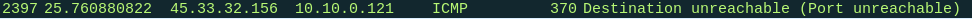

# 操作系统探测

## nmap -O Address 或 nmap -A Address 

    使用TCP / IP堆栈指纹识别进行远程操作系统检测。至少一个打开一个关闭的端口时检查很有效。
    --osscan-limit:跳过不符合的主机 。至少一个打开一个关闭的端口时检查很有效。设置此选项，Nmap甚至不会针对不符合此条件的主机尝试操作系统检测。只有在使用-O或-A请求OS检测时才有意义。
    --osscan-guess; --fuzzy: 打印猜测的OS。当Nmap无法检测到完美的OS匹配时，大胆的猜测近似匹配的对象。
    --max-os-tries: 指定重复次数。当Nmap无法检测到完美的OS匹配时,默认重复5次。条件不好时2次。

## sudo nmap -O -v scanme.nmap.org
 
    Starting Nmap 7.80 ( https://nmap.org ) at 2019-09-17 08:54 CST
    Initiating Ping Scan at 08:54
    Scanning scanme.nmap.org (45.33.32.156) [4 ports]
    Completed Ping Scan at 08:54, 0.20s elapsed (1 total hosts)
    Initiating Parallel DNS resolution of 1 host. at 08:54
    Completed Parallel DNS resolution of 1 host. at 08:54, 0.42s elapsed
    Initiating SYN Stealth Scan at 08:54
    Scanning scanme.nmap.org (45.33.32.156) [1000 ports]
    Discovered open port 22/tcp on 45.33.32.156
    Discovered open port 80/tcp on 45.33.32.156
    Discovered open port 31337/tcp on 45.33.32.156
    Discovered open port 9929/tcp on 45.33.32.156
    Completed SYN Stealth Scan at 08:54, 16.22s elapsed (1000 total ports)
    Initiating OS detection (try #1) against scanme.nmap.org (45.33.32.156)
    Retrying OS detection (try #2) against scanme.nmap.org (45.33.32.156)
    Nmap scan report for scanme.nmap.org (45.33.32.156)
    Host is up (0.17s latency).
    Other addresses for scanme.nmap.org (not scanned): 2600:3c01::f03c:91ff:fe18:bb2f
    Not shown: 991 closed ports
    PORT      STATE    SERVICE
    22/tcp    open     ssh
    80/tcp    open     http
    135/tcp   filtered msrpc
    139/tcp   filtered netbios-ssn
    445/tcp   filtered microsoft-ds
    593/tcp   filtered http-rpc-epmap
    4444/tcp  filtered krb524
    9929/tcp  open     nping-echo
    31337/tcp open     Elite
    Aggressive OS guesses: Linux 2.6.18 (87%), Linux 2.6.32 (87%), Linux 2.6.32 or 3.10 (87%), Linux 2.6.39 (87%), Linux 3.10 - 3.12 (87%), Linux 4.4 (87%), WatchGuard Fireware 11.8 (87%), Synology DiskStation Manager 5.1 (87%), Linux 2.6.35 (87%), Linux 4.9 (87%)
    No exact OS matches for host (test conditions non-ideal).
    Uptime guess: 5.145 days (since Thu Sep 12 05:26:25 2019)
    Network Distance: 15 hops
    TCP Sequence Prediction: Difficulty=255 (Good luck!)
    IP ID Sequence Generation: All zeros

    Read data files from: /usr/bin/../share/nmap
    OS detection performed. Please report any incorrect results at https://nmap.org/submit/ .
    Nmap done: 1 IP address (1 host up) scanned in 22.65 seconds
            Raw packets sent: 1205 (54.904KB) | Rcvd: 1040 (42.984KB)

## sudo nmap -sV -O -v scanme.nmap.org

    虽然TCP指纹识别是一种强大的OS检测方法，但查询开放端口以获取线索是另一种有效的方法。 某些应用程序（如Microsoft IIS）仅在单个平台上运行（因此将其丢弃），而许多其他应用程序在过于冗长的横幅消息中泄露其平台。 添加-sV选项可启用Nmap版本检测，该版本经过培训可以查找这些线索（以及其他信息）。

    Starting Nmap 7.80 ( https://nmap.org ) at 2019-09-17 09:12 CST
    NSE: Loaded 45 scripts for scanning.
    Initiating Ping Scan at 09:12
    Scanning scanme.nmap.org (45.33.32.156) [4 ports]
    Completed Ping Scan at 09:12, 0.21s elapsed (1 total hosts)
    Initiating Parallel DNS resolution of 1 host. at 09:12
    Completed Parallel DNS resolution of 1 host. at 09:12, 0.00s elapsed
    Initiating SYN Stealth Scan at 09:12
    Scanning scanme.nmap.org (45.33.32.156) [1000 ports]
    Discovered open port 80/tcp on 45.33.32.156
    Discovered open port 22/tcp on 45.33.32.156
    Discovered open port 9929/tcp on 45.33.32.156
    Discovered open port 31337/tcp on 45.33.32.156
    Completed SYN Stealth Scan at 09:12, 17.26s elapsed (1000 total ports)
    Initiating Service scan at 09:12
    Scanning 4 services on scanme.nmap.org (45.33.32.156)
    Completed Service scan at 09:12, 6.38s elapsed (4 services on 1 host)
    Initiating OS detection (try #1) against scanme.nmap.org (45.33.32.156)
    Retrying OS detection (try #2) against scanme.nmap.org (45.33.32.156)
    NSE: Script scanning 45.33.32.156.
    Initiating NSE at 09:13
    Completed NSE at 09:13, 0.80s elapsed
    Initiating NSE at 09:13
    Completed NSE at 09:13, 0.72s elapsed
    Nmap scan report for scanme.nmap.org (45.33.32.156)
    Host is up (0.16s latency).
    Other addresses for scanme.nmap.org (not scanned): 2600:3c01::f03c:91ff:fe18:bb2f
    Not shown: 991 closed ports
    PORT      STATE    SERVICE        VERSION
    22/tcp    open     ssh            OpenSSH 6.6.1p1 Ubuntu 2ubuntu2.13 (Ubuntu Linux; protocol 2.0)
    80/tcp    open     http           Apache httpd 2.4.7 ((Ubuntu))
    135/tcp   filtered msrpc
    139/tcp   filtered netbios-ssn
    445/tcp   filtered microsoft-ds
    593/tcp   filtered http-rpc-epmap
    4444/tcp  filtered krb524
    9929/tcp  open     nping-echo     Nping echo
    31337/tcp open     tcpwrapped
    Aggressive OS guesses: Linux 2.6.32 (88%), Linux 2.6.18 (87%), Linux 3.4 (87%), Linux 3.5 (87%), Linux 4.2 (87%), Linux 4.4 (87%), Synology DiskStation Manager 5.1 (87%), WatchGuard Fireware 11.8 (87%), Linux 2.6.35 (87%), Linux 3.10 (87%)
    No exact OS matches for host (test conditions non-ideal).
    Uptime guess: 5.157 days (since Thu Sep 12 05:26:25 2019)
    Network Distance: 13 hops
    TCP Sequence Prediction: Difficulty=262 (Good luck!)
    IP ID Sequence Generation: All zeros
    Service Info: OS: Linux; CPE: cpe:/o:linux:linux_kernel

    Read data files from: /usr/bin/../share/nmap
    OS and Service detection performed. Please report any incorrect results at https://nmap.org/submit/ .
    Nmap done: 1 IP address (1 host up) scanned in 32.76 seconds
            Raw packets sent: 1119 (51.136KB) | Rcvd: 1036 (42.824KB)

### Device type
    所以被识别的指纹都会被分为一个或者多个类型。
    Device Type: router|firewall

### Running
    当没有完全匹配时，nmap将字段更改为running（只是猜测），并在每个候选家族名称后的括号中添加一个准确率百分比（100%是完全匹配）。如果没有指纹是完全匹配的，则忽略该行。
    Linux 2.4.X|2.5.X|2.6.X.

### OS CPE  
    显示了操作系统的通用平台枚举（cpe）表示（如果可用）。它还可以具有硬件类型的cpe表示。os cpe以cpe:/o开头，硬件cpe以cpe:/h开头。
    CPE: cpe:/o:linux:linux_kernel

### OS details
    如果没有任何完美的匹配，但有一些接近的猜测，则将该字段重命名为aggressive os guesses，并在括号中显示指纹，后面跟着一个百分比，指定每个匹配的接近程度。
    Aggressive OS guesses: Linux 2.6.32 (88%), Linux 2.6.18 (87%), Linux 3.4 (87%), Linux 3.5 (87%), Linux 4.2 (87%), Linux 4.4 (87%), Synology DiskStation Manager 5.1 (87%), WatchGuard Fireware 11.8 (87%), Linux 2.6.35 (87%), Linux 3.10 (87%)

### Uptime guess
    检查报头中的时间戳选项。通过观察几个响应，nmap可以确定当前值和增长率。简单的线性外推确定启动时间。如果目标在其syn/ack数据包中提供零或没有时间戳选项，或者根本没有应答，则忽略正常运行时间猜测。如果nmap无法识别时间戳增量率，或者它看起来可疑（如30年的正常运行时间），则该行也将被省略。
    Uptime guess: 5.157 days (since Thu Sep 12 05:26:25 2019)

### Network Distance
    计算nmap和目标主机之间的路由器数量。扫描本地主机时，距离为零，对于同一网段上的计算机，距离为一。路径上的每个附加路由器都会将一个添加到跃点计数中。nmap在无法计算该线时会省略该线（对相关探测没有响应）。
    Network Distance: 13 hops

### TCP Sequence Prediction
    TCP初始序列号生成较差的系统容易受到盲目TCP欺骗攻击。换句话说，您可以与这些系统建立完全连接，并在欺骗不同的IP地址时发送（但不接收）数据。目标的日志将显示欺骗性IP，您可以利用它们之间的任何信任关系。

   许多操作系统已被修复为使用RFC 1948提出的不可预测的初始序列号。出于这些原因，此行仅以详细模式打印。许多供应商仍然提供易受攻击的操作系统和设备，这使得它们对于OS检测目的是有价值的，该类描述了目标使用的ISN生成算法，难度是粗略估计系统进行盲IP欺骗的难度（0是最简单的）。带括号的评论基于难度指数，范围从琐碎的笑话到轻松，中等，强大，值得挑战，最后祝你好运！
    TCP Sequence Prediction: Difficulty=262 (Good luck!)

### IP ID sequence generation
    许多系统基于如何在IP数据包中生成低16位ID字段，无意中泄露了有关其流量级别的敏感信息。这可能被滥用来欺骗针对其他系统的端口扫描，以及用于“TCP空闲扫描（-SI）”一节中讨论的其他恶意目的。此字段描述nmap能够识别的id生成算法。许多系统为与之通信的每个主机使用不同的IP ID空间。在这种情况下，它们可能看起来很脆弱（例如显示增量类），同时仍然能够抵御诸如空闲扫描之类的攻击。出于这个原因，IP ID序列生成行仅以详细模式打印。如果nmap在os检测期间没有收到足够的响应，它将忽略整行。测试主机是否易受空闲扫描僵尸攻击的最佳方法是使用-si对其进行测试。
    IP ID Sequence Generation: All zeros

## tcp/ip指纹识别方法
    发送16个TCP，UDP，ICMP探针确定打开和关闭的端口。这些报文专门利用的RFC文档中的描述不清的地方而设计。侦听响应。分析并组合这些响应中的许多属性以生成指纹。如果没有响应，则每个探测包都被跟踪并重新发送一次。所有这些数据包都是具有随机IP ID值的IPv4数据报文。如果未找到开放的端口，Nmap会跳过对开放的TCP端口的探测。而后Nmap会先检查是否找到了一个确认关闭的TCP或UDP端口。如果还没有，Nmap将随机选择一个端口并希望获得最佳效果。

## Probes Sent发送的探测报文

### Sequence generation (SEQ, OPS, WIN, and T1)序列生成测试（SEQ，OPS，WIN和T1）
    Nmap会发送一系列六个TCP探测报文以生成这四个测试的响应结果。探测报文的时间间隔为精确的100ms，因此发送的总时间为500ms。这里确切的时序是非常重要的，因为我们检测中用到的一些序列算法（初始序列号，IP ID和TCP时间戳）都是与时间密切相关的。 这里总时间被选择为500ms，以便我们可靠地检测常见的2 Hz TCP时间戳序列。

    每个探测都是发送TCP SYN数据包到远程计算机上已检测到的开放端口的。序列seq和确认号ack是随机的（但每一个的情况都会被保留，因此Nmap可以区分每一个的响应）。检测的精度要求探测报文的一致性，因此即使用户主动使用–data-length请求，数据报文中也不会有有效的数据负载。

    这些数据包在TCP选项中有很多不同的使用方式，还有不同的TCP窗口大小值。 以下列表提供了六个数据包的具体选项和值。 列出的窗口大小的值并不会反映窗口缩放的值。EOL是TCP选项结束符，默认情况下许多嗅探工具都不会显示。

### 包#1：窗口缩放（10），NOP，MSS（1460），时间戳（TSval：0xFFFFFFFF; TSecr：0），允许SACK。 窗口大小为1。\

### 包#2： MSS（1400），窗口缩放（0），允许SACK，时间戳（TSval：0xFFFFFFFF; TSecr：0），EOL。 窗口大小为63。

###    包#3：时间戳（TSval：0xFFFFFFFF; TSecr：0），NOP，NOP，窗口缩放（5），NOP，MSS（640）。 窗口大小为4。

###    包#4：允许SACK，时间戳（TSval：0xFFFFFFFF; TSecr：0），窗口缩放（10），EOL。 窗口大小为4。

###    包#5： MSS（536），允许SACK，时间戳（TSval：0xFFFFFFFF; TSecr：0），窗口缩放（10），EOL。 窗口大小是16。

###    包#6： MSS（265），允许SACK，时间戳（TSval：0xFFFFFFFF; TSecr：0）。 窗口大小是512.

    这些测试的结果包括四个类别。 第一个SEQ探测包含基于探测包的序列分析的结果，测试结果表现为GCD，SP，ISR，TI，II，TS和SS的数值。下一个OPS测试包含每个探测报文对应响应结果的TCP选项（测试名称为O1到06）。同理，WIN测试包含响应的窗口大小（名为W1到W6）。与这些探测报文相关的最后一项T1，包含对数据包#1的响应的各种测试值，这些结果决定R，DF，T，TG，W，S，A，F，O，RD和Q的测试值。而这项T1测试仅针对第一个探测报文报告，因为它们对于接下来每个探测报文的反应总是几乎完全相同的。

###  ICMP echo ICMP响应测试（IE）
    发送两个ICMP响应请求数据包到目标。 
    
### ICMP包1
    IP DF位会置位，服务类型（TOS） 字节值为0，代码为9（即使它应该为0），序列号为295， IP ID和ICMP请求标识符随机，以及120字节的0x00用于数据有效载荷。

### ICMP包2
    ping询问也类似，除了使用四个TOS（ IP_TOS_RELIABILITY ），代码为零，发送150个字节的数据，并且ICMP请求标识符和序列号也从先前的值加1。

    将这两种探测报文的响应，组合为R，DFI，T，TG和CD的测试结果。只有两个探测报文都引出响应，R值才为真（Y）。 T和CD值仅来自第一个探测的响应结果，因为两次的结果会完全一致。 DFI是针对特殊的双探测报文ICMP外壳的定制测试。

    这些ICMP探测会在TCP序列探测之后立即进行，以确保共享IP ID序列号测试的有效结果

### TCP explicit congestion notification (ECN) TCP显式拥塞通知测试（ECN）
    测试目标TCP栈中是否支持显式拥塞通知（ECN）。Nmap通过发送一个SYN数据包对此进行测试，该数据包设置了ECN、CWR和ECE拥塞控制标志。对于不相关（到ECN）测试，即使未设置紧急标志，也使用0xF7F5的紧急字段值，确认号为0，序列号随机，窗口大小为3，并且紧接在CWR位之前的保留位被置位。 TCP选项是：窗口缩放（10），NOP，MSS（1460），允许SACK，NOP，NOP，探测报文被发送到开放端口。

    如果收到响应，则记录R，DF，T，TG，W，O，CC和Q的测试值。

 
 
 

### TCP (T2–T7) TCP测试（T2 - T7）
    T2到T7测试每个会发送一个TCP探测包。除了有一个例外，其他包的TCP选项数据都是（十六进制） 03030A0102040109080AFFFFFFFF000000000402。这20个字节对应于：窗口缩放（10），NOP，MSS（265），时间戳（TSval：0xFFFFFFFF; TSecr：0），然后允许SACK。 这里例外的情况是指T7使用的窗口缩放为15而不是10。每个探测报文的变量特征如下所述：

###    T2发送一个TCP空（无标志设置< NONE>）数据包，其中IP DF置位，窗口大小为128，发送到开放端口。
 
 
 
 
 
 
 
 

###    T3发送一个TCP SYN，FIN，URG和PSH标志置位数据包，其中IP DF未置位，窗口大小为256，发送到开放端口。
 
 
 
 
 
 

 

###    T4发送一个TCP ACK数据包，其中IP DF置位，窗口大小为1024，发送到开放端口。

 

###    T5发送一个TCP SYN数据包，其中IP DF未置位，窗口大小为31337，发送到关闭端口。

###   T6发送一个TCP ACK数据包，其中IP DF置位，窗口大小为32768，发送到关闭端口。

###    T7发送一个TCP FIN，URG和PSH标志置位数据包，其中IP DF未置位，窗口大小为65535，发送到关闭端口。

    在每种情况下，将每一次的结果添加到指纹中，其结果为R，DF，T，TG，W，S，A，F，O，RD和Q的测试值。

### UDP (U1) UDP测试（U1）

    此探测发送一个UDP数据包到关闭端口。 其中的数据字段，是字符“C”（0x43）重复300次。 对于允许我们设置此操作的操作系统，IP ID值会被设置为0x1042。 如果端口真的关闭了并且没有防火墙，则Nmap期望收到ICMP端口不可达消息作为回复。然后该响应结果为R，DF，T，TG，IPL，UN，RIPL，RID，RIPCK，RUCK和RUD的测试值。

## Response Tests各种测试内容

### TCP ISN greatest common divisor (GCD) TCP ISN最大公约数（GCD）
    SEQ测试会将六个TCP SYN数据包发送到目标机器的开放端口，并回收应答的SYN / ACK数据包。 这些SYN / ACK分组中的每一个包含32位初始序列号（initial sequence number ISN）。 此测试目的是尝试确定目标主机增加这些值的最小增量。例如，许多主机（尤其是旧主机）总是以64000的倍数递增ISN。

    计算此问题的第一步是在探测响应之间创建一系列差异。 第一个差值是第一和第二探测响应ISN之间的差异。 第二个差值是第二个和第三个响应之间的差异。 如果Nmap回收到对所有六个探测的响应，则会有五个差值构成一个数组。由于接下来的几个测试的值也使用了这个数组，我们接下来将其称为diff1。如果后来的报文的ISN低于它的前一个，则Nmap会记算从第一个值中减去第二个值的大小，或第二个值减去第一个值，对比这两个值中较小的一个存储在diff1数组中（译者：这里翻译的有点不清楚…意思大概是可以循环计算差值，实际计算的方法自己看接下来的例子）。因此0x20000后跟0x15000之间的差值是0xB000。 0xFFFFFF00和0xC000之间的差值是0xC0FF。 最后，该测试值记录所有这些差值的最大公约数。该GCD值也用于计算接下来的SP的结果。

    squence number from responce    差值数组
    包一： e8 3f 5e 02  3896466946  1949891380
    包二： 74 06 62 ce  1946575566  1441535360
    包三： c9 f2 78 4e  3388110926   678692697
    包四： f2 66 7f a7  4066803623  1211720664
    包五： 3a 9f e3 7f   983556991  1185428050
    包六： f3 f7 b1 2d  4093096237  
    差值的最大共约数为GCD

### TCP ISN counter rate (ISR)
    此值反应返回的报文中TCP初始序列号的平均增长率。 回想一下，每两个连续的探测响应之间存在差异，这差值存储在先前讨论的diff1阵列中。 这些差异除以发送产生它们的两个探测报文之间经过的时间之差（以秒为单位 - 通常约为0.1）。 结果也将是一个数组，我们称之为seq_rates，其中就含有每秒ISN计数器增加的速率信息。该数组对diff1数组中每个值都有一个对应值。我们接下来取该数组值的平均值，如果该平均值小于1（例如，系统使用恒定的ISN），则记录ISR为0。否则，ISR是计算该平均值的二进制对数再乘以8的值，这里要四舍五入到最接近的整数。
            差值数组    seq_rates
    包二： 1949891380   19498913800
    包三： 1441535360   14415353600
    包四：  678692697    6786926970
    包五： 1211720664   12117206640
    包六： 1185428050   11854280500
    均值： 12934536302
    ISR = 33.59 * 8 = 268.72 = 269 = 01 0d

### TCP ISN sequence predictability index (SP)
    前面ISR测试测量的是初始序列号增量的平均速率，而SP值测量的是ISN的可变性。它会粗略估计从六个探测响应的已知序列，来分析预测下一个ISN值的困难程度。计算时要使用上一小节中讨论的差异数组（seq_rates）和GCD值。并且我们只有在看到至少四个响应时才执行此测试。 如果先前计算的GCD值大于9，则用先前计算的seq_rates数组的每个值除以该GCD值。我们不用较小的GCD值进行除法，因为这些值通常是偶然引起的。 然后获得所得值的阵列的标准偏差。如果结果为1或更小，则SP取0。否则，计算结果的二进制对数，然后将其乘以8，四舍五入到最接近的整数，存储为SP的值 。

    请记住，此测试仅用于OS检测目的，并不能作为对目标ISN生成器的全面审核分析。即使SP值很高，也有会许多算法缺陷导致ISN易于预测。

### IP ID sequence generation algorithm (TI, CI, II)
    这三个测试会检查响应的IP头ID字段。TI基于对TCP SEQ探测的响应。CI基于对发送到关闭端口的三个TCP探测的响应：T5，T6和T7。（译者：前面出现了这三个探测报文，自己去翻一下）II基于ICMP对两个IE ping探测报文的响应。对于TI ，必须至少收到三个响应才能有测试结果。对于CI，至少需要两个响应。对于II，必须收到对应的ICMP响应。

    对于这其中每一个测试，目标的IP ID生成算法会基于以下规则进行分类。需要注意这些测试值之间的细微差别。请注意，该差值假定计数器可以循环。因此，如果IP ID为65,100后面跟着的IP ID值是700的话，它们之间的差值为1136。 如果2000之后跟的是1100的话，之间的差值是64636。以下是测试值规则：

    如果所有IP ID号都为零，则测试值为Z。

    如果IP ID序列增量大于等于20000，则测试值为RD（随机）。II不可能是这个结果，因为没有足够的样本来支持它。

    如果所有IP ID都相同，则将测试值设置为十六进制的该值。

    如果任何两个连续响应之间的ID差值超过1000，且不能被256整除，则测试的值为RI（随机正增量）。如果差值可以被256整除，则必须至少为256000才能产生此RI结果。

    如果所有差值都可以被256整除并且不大于5120，则将测试设置为BI（递增增量）。 这种情况会发生在Microsoft Windows等系统上，其中IP ID以主机字节顺序而不是网络字节顺序发送。它能够正常工作并且没有违反任何类型的RFC规则，尽管它确实泄露了对攻击者有用的主机架构细节。

    如果所有差值都小于10，则值为I（增量）。我们允许这里差值大小达到10（而不是需要所有的都完全按顺序增量排序），因为可能有来自其他主机的流量导致序列间隙。

    如果前面的规则都没有识别生成算法的测试结果，则从指纹中省略该测试。

    包一： 0000
    包二： 0000
    包三： 0000
    包四： 0000
    包五： 0000
    包六： 0000
   
    T5: 0000
    T6: 0000
    T7: wu

    II: f0ad - f364 = 1594

    TI：z  CI:z  II: RI

### Shared IP ID sequence Boolean (SS)
    此布尔值记录目标是否在TCP和ICMP协议之间共享其IP ID序列。 如果我们的六个TCP IP ID值是117,118,119,120,121和122，而我们的ICMP结果是123和124，很明显，这两个序列不仅是递增的，而且它们都是相同序列的一部分。 另一方面，如果TCP IP ID值是117-122但ICMP值是32917和32918，则说明使用了两个不同的序列。

    这里仅当II和TI为RI，BI或I且二者相同时才进行此测试。如果进行SS测试，则如果序列被共享则结果为S，如果不共享则结果为O（其他）。该测试以以下规则进行：

    令avg为最后一个TCP序列测试报文响应的IP ID减去第一个TCP序列测试报文响应的IP ID，再除以之间探测报文数的差值。 如果探测报文#1的响应的IP ID为10,000而探测器#6的响应为20,000，则avg为（20,000 - 10,000）/（6 - 1），等于2,000。

    如果第一个ICMP回应响应的IP ID小于最后一个TCP序列响应的IP ID加上该avg的三倍，则SS测试结果为S，否则就是O

### TCP timestamp option algorithm (TS)
    TS是另一个测试，根据生成一系列数字的方式确定目标操作系统特征。 这个测试查看TCP SEQ探测的响应中的TCP时间戳选项（如果有的话）。它检查的是TSval（选项的前四个字节）而不是回显的TSecr（最后四个字节）值。取每个连续TSval之间的差值，并除以Nmap发送两个探测报文之间，响应经过的时间。 其结果值给出了每秒时间戳增量的速率。Nmap会计算所有连续探测报文的时间戳每秒平均增量，然后按如下方式计算TS ：

    如果任何响应都没有时间戳选项，则TS设置为U（不支持）。

    如果任何时间戳值为0，则TS设置为0。

    如果每秒的平均增量落在0-5.66或150-350的范围内，则TS设置为1,7或8。 这三个范围会被特殊处理，是因为它们对应于许多主机使用的2 Hz，100 Hz和200 Hz频率。

    在所有其他情况下，Nmap记录每秒平均增量的二进制对数，四舍五入到最接近的整数。由于大多数主机使用1,000 Hz频率，因此A也是常见结果

    包一： 1a cd 8a 2f  449677871
    包二： 1a cd 8a 9c  449677980   1090
    包三： 1a cd 8b 00  449678080   1000
    包四： 1a cd 8b 56  449678166   860
    包五： 1a cd 8b ca  449678282   1160
    包六： 1a cd 8c 24  449678372   900
    平均增量：1000hz  10
    TS:A

### TCP options (O, O1–O6)
    此测试记录数据包中的TCP头部选项字段（TCP option）的情况。它保留了其中的原始顺序，并提供了有关选项值的一些信息。 由于RFC 793中不需要我们有任何特定的排序，因此不同系统对这里的实现通常会提供独特的顺序。 有些平台没有实现所有选项（没问题，它们本来就是可选的）。 当您将所有这些不同的实现顺序，与对不同选项值使用的数量都组合在一起时，此测试就提供了一个真实有效的信息库。此测试的值是表示正在使用选项的字符。有几个选项会在其后面立即生成相关参数。这

    选项名称 字符 参数（如果有的话）
    选项部分结束符（EOL） L
    无操作（NOP） N
    最大段大小（MSS） M 附加参数值，许多系统会回显相应探测中使用的值。
    窗口缩放（WS） W 附加实际参数值。
    时间戳（TS） T 后面跟着两个二进制字符，分别代表TSval和TSecr值。 如果字段为零，则字符为0，否则为1。
    允许选择性ACK（SACK） S

    例如，字符串M5B4NW3NNT11表示该数据包包含MSS选项（值0x5B4），后跟一个NOP。接下来是一个窗口缩放选项，其值为3，然后是两个NOP。 最后一个选项是时间戳，它的两个字段都不为零。 如果响应中没有TCP选项，则测试仍然存在，但值字符串将为空。如果未响应探测报文，则省略该测试。

    虽然此测试通常命名为O，但会发送六个探测报文生成一个序列，这只是一种特殊的处理方式。（译者：这里需要多说一句，这句话的意思就是只是因为ops可以和seq一起测试，不用自己在单独发包，所以…就记录六个了（因为seq发了六个包），下面的w测试同理，这三个测试都用的是同样的六个包的响应）这些测试被插入到特殊的OPS测试组中，并采用名称O1到O6来区分它们所涉及的探测包。“O”代表“选项”。尽管名称序号不同，但每个测试O1到O6的处理方式都完全相同。

    包一： M5ACST11NW7
    包二： M5ACST11NW7
    包三： M5ACNNT11NW7
    包四： M5ACST11NW7
    包五： M5ACST11NW7
    包六： M5ACST11NW7

### TCP initial window size (W, W1–W6)
    此测试仅记录接收数据包的16位TCP窗口大小。它非常有效，因为有超过80个值已知至少会由某一个OS发送。但不利的一面是，某些OS本身就具有十几种可能的值。在我们完全收集操作系统使用的所有可能的窗口大小之前，这可能会导致错误的判断结果。

    虽然此测试通常命名为W ，但会发送六个探测报文生成一个序列，这只是一种特殊的处理方式。 这些测试被插到特殊的WIN测试组中，并取名为W1到W6。 所有序列号探测报文的响应都会有记录的窗口大小，因为它们在TCP MSS选项值上有所不同，这会导致有些操作系统回显不同的窗口大小。尽管名称序号不同，但每个测试W1到W6的处理方式都完全相同。
    
    包一： 65160
    包二： 65160
    包三： 65160
    包四： 65160
    包五： 65160
    包六： 65160

### Responsiveness (R)
    此测试仅记录目标是否响应我们给定的探测报文。 可能的值为Y和N 如果没有响应（N），则省略测试的其他字段。（译者：响应都没有就不用提接下来的分析了。）

    此测试的风险是探测报文可能被防火墙丢弃，这必然导致在指纹中的R=N。然而，如果目标OS对该项测试能够正常回复，则nmap-os-db中该系统的参考指纹是有R=Y的。这里说明了防火墙可能会阻止正确的OS检测结果。为了减少这个问题，参考用的指纹通常省略了IE和U1探测报文的R=Y测试，因为这些探测报文是最可能被丢弃的。此外，如果Nmap对目标缺少确定的关闭TCP端口，即使它去尝试的端口没有任何响应，它也不会将T5，T6或T7测试的结果设置为R=N，毕竟缺少一个确定关闭的端口可能是因为它们都被过滤掉了.

    包一： Y
    T2: N
    T3: N
    T4: N
    T5: Y
    T6: 
    T7: 

### IP don't fragment bit (DF)
    IP报头包含一个可以禁止路由器将数据包分段的位。这表示如果数据包对于路由器来说太大而无法处理，则只需要丢弃它（理想情况下会返回“目标无法到达，需要分段”响应）。如果该位置位，则该测试记录Y，否则则记录N。

    包一： Y
    T2:
    T3:
    T4:
    T5: Y
    T6:
    T7:
    

### Don't fragment (ICMP) (DFI)
    这只是用于特殊IE探测报文的DF测试修改版。它比较了发送的两个ICMP回送请求探测报文的do not fragment（不分段）位的结果。它有四个可能的值，在表8.2中列举了。

    值 描述
    N 两个ping响应都没有设置DF位。
    S 两个响应都回显探测报文的DF值。
    Y 两个响应DF位都已置位。
    O 两个响应都有DF位切换。（和S的情况相反）
    
    ICMP包一： N
    ICMP包二： N
    DFI: N

### IP initial time-to-live (T)
    IP数据包包含一个名为生存时间（TTL）的字段，该字段在每次遍历路由器时递减。 如果字段达到零，则必须丢弃该数据包。 这可以防止数据包无休止地在网络中循环。由于操作系统的起始TTL值不同，因此该值可用于OS检测。Nmap通过检查对U1探测报文对应的ICMP端口不可达响应来确定它与目标的跳数。 该响应包含目标接收的原始IP报文，还有已经减少的TTL字段。通过从我们发送的TTL中减去该值，我们可以了解机器到达的位置的跳数。 Nmap然后不断添加距离去探测能有响应时的TTL值，以确定对方发送ICMP探测响应数据包时的初始TTL。（译者：这里有点迷糊，我的理解是接近于traceroute的方式？）该初始TTL值作为T结果存储在指纹中。

    尽管像TTL这样的8位字段永远不会产生大于0xFF的值，但此测试偶尔会使值为0x100或更高。当系统（可能是源，目标或其间的系统）损坏或以其他方式无法正确递减TTL时，就会发生这种情况。它也可能由于不对称的路线而发生。

    当跳数距离为0（本地主机扫描）或为1（在同一网段上）时，Nmap还可以从系统接口和路由表中直接学习。这里当Nmap显示用户的跳距时会使用此值，但不用于T结果计算。

    TTL1:45
    TTL2:48
    T:59 - 45 = 14
    T:62 - 48 = 14

### IP initial time-to-live guess (TG)
    Nmap没有接收到对U1探测报文的响应的情况并不罕见，这会阻止Nmap了解到目标的跳数。防火墙和NAT设备倾向于阻止未经请求的UDP数据包。但是由于常见的TTL值分散得很远，目标很少和某个对应的值差距超过20跳，所以无论如何Nmap都可以做出相当不错的猜测。大多数系统会发送初始TTL为32,60,64,128或255的数据包。因此，会将响应中收到的TTL值向上取为32,64,128或255。60不在这个清单里因为它无法明显地与64区分开来…总而言之它很少见。结果猜测会存储在TG字段中。不过如果能获得实际TTL（T）值，则不会在系统指纹中显示此TTL猜测字段。

### Explicit congestion notification (CC)
    该测试仅用于ECN探测报文。该探测是一个SYN数据包，含有CWR和ECE拥塞控制标志。当接收到响应SYN / ACK时，会检查那些标志以得到CC（拥塞控制）的测试值

    值 描述
    Y 仅置位ECE（没有置位CWR），该主机支持ECN。
    N 这两个位都没有置位，目标不支持ECN。
    S 两个位都已置位，目标不支持ECN，但它回应了它认为是保留位的内容。
    O 这两个位的其余组合（其他）。

    CC:Y

### TCP miscellaneous quirks (Q)
    该项测试检查在TCP栈中的一些实现的两个可能倾向。 第一个是TCP头部中的保留字段（在头部长度项之后）非零。 这很有可能发生在ECN测试中，因为它在探测中设置了保留位。 如果在数据包中看到这种情况，则在Q测试值中记录“R”。

    当未设置URG标志时，另一个是对于非零紧急指针字段值。这也是很有可能在ECN探测报文响应中看到的，该探测报文设置非零紧急场。当看到这一点时，在Q字符串上附加“U”。

    必须始终按字母顺序生成Q字符串。 如果没有倾向，则Q测试为空但仍然显示。

    Q:NULL

### TCP sequence number (S)
    此测试检查TCP头部中的32位序列号字段。 它不是像其他测试那样记录字段值，而是检查它与引发响应的探测报文的TCP确认号的比较情况。然后它根据结果记录适当的值

    值 描述
    Z 序列号为0。
    A 序列号与探测报文中的确认号相同。
    A+ 序列号是探测报文中的确认号加1。
    O 序列号是别的（其他）。

    包一：    e8 3f 5e 02  c1 37 fb 44      S: O
    T2：                  c1 37 fb 44       S: O
    T3：                  c1 37 fb 44       S: O
    T4：                  c1 37 fb 44       S: O
    T5：     00 00 00 00  c1 37 fb 44       S: O
    T6：                  c1 37 fb 44       S: O
    T7：                  c1 37 fb 44       S: O
    S:O

### TCP acknowledgment number (A)
    此测试与S相同，不同之处在于它测试响应中的确认号与相应探测报文中的序列号的比较情况。

    值 描述
    Z 确认号为0。
    S 确认号与探测报文中的序列号相同。
    S+ 确认号是探测报文中的序列号加1。
    O 确认号是别的（其他）。

    包一： 2a 82 d7 e5  2a 82 d7 e6
    T2：
    T3：
    T4：
    T5：  2a 82 d7 e5  2a 82 d7 e6
    T6：
    T7:
    A：S+

### TCP flags (F)
    该字段记录响应中的TCP标志位。每个字母代表一个标志，它们的出现顺序需要与TCP数据包中的顺序相同（从左侧的高位到低位）。例如，值AS表示ACK和SYN位置位，而值SA是非法的（错误的顺序）。

    字符 标志名称 标志字节值
    E 阻塞标志（ECE） 64
    U 紧急标志（URG） 32
    A 确认标志（ACK） 16
    P 推标志（PSH） 8
    R 重置标志（RST） 4
    S 同步标志（SYN） 2
    F 结束标志（FIN） 1

    包一：  AS
    T2：    
    T3：
    T4：
    T5：    S
    T6：
    T7:

### TCP RST data checksum (RD)
    某些操作系统会返回ASCII码数据，例如重置（RST）数据包中的错误消息。RFC 1122中的4.2.2.12节明确允许这样做。而当Nmap遇到此类数据时，它会执行CRC32校验和并报告结果。 当这里没有数据时，RD设置为0。可能在其重置数据包中返回数据的少数几个操作系统是HP-UX和Mac OS X之前的Mac OS版本。

    RD: 0

### IP total length (IPL)
    此测试记录IP数据包的总长度（以8位字节为单位）。它仅使用U1测试引发的端口不可达响应。 该长度因实际实现情况而不同，因为只要它们最低满足RFC 1122的要求，就可以选择原始探测报文中包含的数据量。这个要求是包括原始IP头部和至少8个字节长的数据。

    IPL:356

### Unused port unreachable field nonzero (UN)
    ICMP端口不可达消息头长度为8个字节，但仅使用前4个。RFC 792规定最后4个字节必须为0。 一些机器对它的实现（主要是以太网交换机和一些专门的嵌入式设备）无论如何设置，最后4个字节的值都会记录在该字段中。

    UN: 00 00

### Returned probe IP total length value (RIPL)
    ICMP端口不可达消息（为响应U1探测报文而发送）需要包含使它们生成的报文的IP头部。 此头部应该在收到它时返回，但是由于在对IP处理期间所做的更改，某些情况会发回一个损坏的版本。 此测试仅记录返回的IP总长度值。 如果返回正确的值0x148（328），则存储值G（表明头部是好的）而不是实际值。

    RIPL: G

### Returned probe IP ID value (RID)
    U1探测报文的静态IP ID值为0x1042。如果在端口不可达消息中返回该值，则为该测试值为G。否则，该测试值将为返回的确切值。某些系统（如Solaris）会处理Nmap发送的原始IP数据包的IP ID值。在这种情况下，将跳过此测试。我们发现某些系统，特别是HP和Xerox打印机，会翻转字节并返回0x4210。
    
    RID: G

### Integrity of returned probe IP checksum value (RIPCK)
    IP校验和是我们不期望在端口无法访问的消息返回时保持不变的一个值。 毕竟，传输过程中的每一跳都会随着TTL的减少而改变校验和。但是，我们收到的校验和应与封闭的IP数据包内容匹配。如果是，则该测试值G为（良好）。如果返回值为0，则为Z，否则结果是I（无效）。

    RIPCK: I

### Integrity of returned probe UDP checksum (RUCK)
    UDP报头校验和的值应该与发送时完全一样。如果是，则记录该测试值为G，否则记录实际返回的值。

    RUCK: eb c2

### Integrity of returned UDP data (RUD)
    此测试检查（可能是截断的）返回的UDP有效负载的完整性。如果所有有效载荷字节都是预期的’C’（0x43），或者如果有效载荷被截断为零长度，则记录G ; 否则，I（无效）将被记录下来。

    RUD:G

### ICMP response code (CD)
    ICMP回应答复（类型0）数据包的代码值应该为0。但是一些实现错误地发送了其他值，特别是如果应答请求具有非0代码（如IE测试之一那样）。两个探测报文的响应代码值会组合得成一个CD值

    值 描述
    Z 两个代码值均为零。
    S 两个代码值都与相应的探测报文中的相同。
    < NN> 当它们都使用相同的非零数字时，会显示在这里。
    O 任何其他组合。
    
    CD: S

