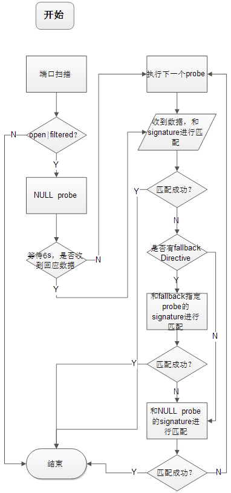

# 服务和版本探测

## nmap -sV Address 或 nmap -A Address 

    试图确定端口对应的服务，应用，版本号，主机名，设备类型，OS类型和其他信息。当RPC服务被发现时，会自动用于确定RPC程序和版本号，即使在防火墙之后。当找到一个在数据库里不存在的协议时nmap提供一个URL上传这个服务的信息。
    --allports: 默认情况下会跳过TCP端口9100。设置后会检测此端口。
    --version-intensity <intensity>: 探测强度，细粒度0-9。级别越高越准确，但时间也越长，默认7.
    --version-light: 即 --version-intensity 2。
    --version-all: 即 --version-intensity 9。
    --version-trace: --packet-trace的子集。打印出调试信息。

## 一个例子
    nmap -sV -T4 -F insecure.org
    Starting Nmap 7.80 ( https://nmap.org ) at 2019-09-11 17:09 CST
    Nmap scan report for insecure.org (45.33.49.119)
    Host is up (0.19s latency).
    Other addresses for insecure.org (not scanned): 2600:3c01::f03c:91ff:fe98:ff4e
    rDNS record for 45.33.49.119: ack.nmap.org
    Not shown: 95 filtered ports
    PORT    STATE  SERVICE VERSION
    22/tcp  open   ssh     OpenSSH 7.4 (protocol 2.0)
    25/tcp  open   smtp    Postfix smtpd
    80/tcp  open   http    Apache httpd 2.4.6
    113/tcp closed ident
    443/tcp open   ssl/ssl Apache httpd (SSL-only mode)
    Service Info: Host:  ack.nmap.org

    Service detection performed. Please report any incorrect results at https://nmap.org/submit/ .
    Nmap done: 1 IP address (1 host up) scanned in 44.79 seconds

    nmap -A -T4 -F www.microsoft.com
    Starting Nmap 7.80 ( https://nmap.org ) at 2019-09-11 17:17 CST
    Nmap scan report for www.microsoft.com (27.148.139.88)
    Host is up (0.044s latency).
    Not shown: 98 filtered ports
    PORT    STATE SERVICE   VERSION
    80/tcp  open  http      GHost
    | fingerprint-strings: 
    |   FourOhFourRequest: 
    |     HTTP/1.0 400 Bad Request
    |     Server: GHost
    |     Mime-Version: 1.0
    |     Content-Type: text/html
    |     Content-Length: 298
    |     Expires: Wed, 11 Sep 2019 09:15:50 GMT
    |     Date: Wed, 11 Sep 2019 09:15:50 GMT
    |     Connection: close
    |     <HTML><HEAD>
    |     <TITLE>Invalid URL</TITLE>
    |     </HEAD><BODY>
    |     <H1>Invalid URL</H1>
    |     requested URL "http&#58;&#47;&#47;&#37;5bNo&#37;20Host&#37;5d&#47;nice&#37;20ports&#37;2C&#47;Tri&#37;6Eity&#46;txt&#37;2ebak", is invalid.

    |     Reference&#32;&#35;9&#46;e46f9b1b&#46;1568193350&#46;64ea4b2
    |     </BODY></HTML>
    |   GetRequest: 
    |     HTTP/1.0 400 Bad Request
    |     Server: GHost
    |     Mime-Version: 1.0
    |     Content-Type: text/html
    |     Content-Length: 207
    |     Expires: Wed, 11 Sep 2019 09:15:44 GMT
    |     Date: Wed, 11 Sep 2019 09:15:44 GMT
    |     Connection: close
    |     <HTML><HEAD>
    |     <TITLE>Invalid URL</TITLE>
    |     </HEAD><BODY>
    |     <H1>Invalid URL</H1>
    |     requested URL "&#91;no&#32;URL&#93;", is invalid.

    |     Reference&#32;&#35;9&#46;68c941b&#46;1568193344&#46;8b3558b
    |     </BODY></HTML>
    |   HTTPOptions: 
    |     HTTP/1.0 400 Bad Request
    |     Server: GHost
    |     Mime-Version: 1.0
    |     Content-Type: text/html
    |     Content-Length: 209
    |     Expires: Wed, 11 Sep 2019 09:15:44 GMT
    |     Date: Wed, 11 Sep 2019 09:15:44 GMT
    |     Connection: close
    |     <HTML><HEAD>
    |     <TITLE>Invalid URL</TITLE>
    |     </HEAD><BODY>
    |     <H1>Invalid URL</H1>
    |     requested URL "&#91;no&#32;URL&#93;", is invalid.

    |     Reference&#32;&#35;9&#46;ec6f9b1b&#46;1568193344&#46;543b1b51
    |     </BODY></HTML>
    |   RTSPRequest: 
    |     HTTP/1.0 400 Bad Request
    |     Server: GHost
    |     Mime-Version: 1.0
    |     Content-Type: text/html
    |     Content-Length: 215
    |     Expires: Wed, 11 Sep 2019 09:15:44 GMT
    |     Date: Wed, 11 Sep 2019 09:15:44 GMT
    |     Connection: close
    |     <HTML><HEAD>
    |     <TITLE>Bad Request</TITLE>
    |     </HEAD><BODY>
    |     <H1>Bad Request</H1>
    |     Your browser sent a request that this server could not understand.

    |     Reference&#32;&#35;7&#46;68c941b&#46;1568193344&#46;0
    |     </BODY>
    |_    </HTML>
    |_http-server-header: GHost
    |_http-title: Access Denied
    443/tcp open  ssl/https GHost
    | fingerprint-strings: 
    |   FourOhFourRequest: 
    |     HTTP/1.0 400 Bad Request
    |     Server: GHost
    |     Mime-Version: 1.0
    |     Content-Type: text/html
    |     Content-Length: 297
    |     Expires: Wed, 11 Sep 2019 09:15:51 GMT
    |     Date: Wed, 11 Sep 2019 09:15:51 GMT
    |     Connection: close
    |     <HTML><HEAD>
    |     <TITLE>Invalid URL</TITLE>
    |     </HEAD><BODY>
    |     <H1>Invalid URL</H1>
    |     requested URL "http&#58;&#47;&#47;&#37;5bNo&#37;20Host&#37;5d&#47;nice&#37;20ports&#37;2C&#47;Tri&#37;6Eity&#46;txt&#37;2ebak", is invalid.

    |     Reference&#32;&#35;9&#46;68c941b&#46;1568193351&#46;8b373de
    |     </BODY></HTML>
    |   GetRequest: 
    |     HTTP/1.0 400 Bad Request
    |     Server: GHost
    |     Mime-Version: 1.0
    |     Content-Type: text/html
    |     Content-Length: 207
    |     Expires: Wed, 11 Sep 2019 09:15:50 GMT
    |     Date: Wed, 11 Sep 2019 09:15:50 GMT
    |     Connection: close
    |     <HTML><HEAD>
    |     <TITLE>Invalid URL</TITLE>
    |     </HEAD><BODY>
    |     <H1>Invalid URL</H1>
    |     requested URL "&#91;no&#32;URL&#93;", is invalid.

    |     Reference&#32;&#35;9&#46;68c941b&#46;1568193350&#46;8b355ce
    |     </BODY></HTML>
    |   HTTPOptions: 
    |     HTTP/1.0 400 Bad Request
    |     Server: GHost
    |     Mime-Version: 1.0
    |     Content-Type: text/html
    |     Content-Length: 207
    |     Expires: Wed, 11 Sep 2019 09:15:51 GMT
    |     Date: Wed, 11 Sep 2019 09:15:51 GMT
    |     Connection: close
    |     <HTML><HEAD>
    |     <TITLE>Invalid URL</TITLE>
    |     </HEAD><BODY>
    |     <H1>Invalid URL</H1>
    |     requested URL "&#91;no&#32;URL&#93;", is invalid.

    |     Reference&#32;&#35;9&#46;68c941b&#46;1568193351&#46;8b3735a
    |     </BODY></HTML>
    |   RTSPRequest: 
    |     HTTP/1.0 400 Bad Request
    |     Server: GHost
    |     Mime-Version: 1.0
    |     Content-Type: text/html
    |     Content-Length: 216
    |     Expires: Wed, 11 Sep 2019 09:16:01 GMT
    |     Date: Wed, 11 Sep 2019 09:16:01 GMT
    |     Connection: close
    |     <HTML><HEAD>
    |     <TITLE>Bad Request</TITLE>
    |     </HEAD><BODY>
    |     <H1>Bad Request</H1>
    |     Your browser sent a request that this server could not understand.

    |     Reference&#32;&#35;7&#46;df6f9b1b&#46;1568193361&#46;0
    |     </BODY>
    |_    </HTML>
    |_http-server-header: GHost
    |_http-title: Access Denied
    | ssl-cert: Subject: commonName=www.microsoft.com/organizationName=Microsoft Corporation/stateOrProvinceName=WA/countryName=US
    | Subject Alternative Name: DNS:privacy.microsoft.com, DNS:c.s-microsoft.com, DNS:microsoft.com, DNS:i.s-microsoft.com, DNS:staticview.microsoft.com, DNS:www.microsoft.com, DNS:wwwqa.microsoft.com
    | Not valid before: 2018-01-16T21:24:02
    |_Not valid after:  2020-01-16T21:24:02
    |_ssl-date: TLS randomness does not represent time
    | tls-alpn: 
    |_  http/1.1
    | tls-nextprotoneg: 
    |   http/1.1
    |_  http/1.0
    2 services unrecognized despite returning data. If you know the service/version, please submit the following fingerprints at https://nmap.org/cgi-bin/submit.cgi?new-service :
    ==============NEXT SERVICE FINGERPRINT (SUBMIT INDIVIDUALLY)==============
    SF-Port80-TCP:V=7.80%I=7%D=9/11%Time=5D78BBA3%P=x86_64-pc-linux-gnu%r(GetR
    SF:equest,19B,"HTTP/1\.0\x20400\x20Bad\x20Request\r\nServer:\x20GHost\r\nM
    SF:ime-Version:\x201\.0\r\nContent-Type:\x20text/html\r\nContent-Length:\x
    SF:20207\r\nExpires:\x20Wed,\x2011\x20Sep\x202019\x2009:15:44\x20GMT\r\nDa
    SF:te:\x20Wed,\x2011\x20Sep\x202019\x2009:15:44\x20GMT\r\nConnection:\x20c
    SF:lose\r\n\r\n<HTML><HEAD>\n<TITLE>Invalid\x20URL</TITLE>\n</HEAD><BODY>\
    SF:n<H1>Invalid\x20URL</H1>\nThe\x20requested\x20URL\x20\"&#91;no&#32;URL&
    SF:#93;\",\x20is\x20invalid\.
\nReference&#32;&#35;9&#46;68c941b&#46;156
    SF:8193344&#46;8b3558b\n</BODY></HTML>\n")%r(HTTPOptions,19D,"HTTP/1\.0\x2
    SF:0400\x20Bad\x20Request\r\nServer:\x20GHost\r\nMime-Version:\x201\.0\r\n
    SF:Content-Type:\x20text/html\r\nContent-Length:\x20209\r\nExpires:\x20Wed
    SF:,\x2011\x20Sep\x202019\x2009:15:44\x20GMT\r\nDate:\x20Wed,\x2011\x20Sep
    SF:\x202019\x2009:15:44\x20GMT\r\nConnection:\x20close\r\n\r\n<HTML><HEAD>
    SF:\n<TITLE>Invalid\x20URL</TITLE>\n</HEAD><BODY>\n<H1>Invalid\x20URL</H1>
    SF:\nThe\x20requested\x20URL\x20\"&#91;no&#32;URL&#93;\",\x20is\x20invalid
    SF:\.
\nReference&#32;&#35;9&#46;ec6f9b1b&#46;1568193344&#46;543b1b51\n<
    SF:/BODY></HTML>\n")%r(RTSPRequest,1A3,"HTTP/1\.0\x20400\x20Bad\x20Request
    SF:\r\nServer:\x20GHost\r\nMime-Version:\x201\.0\r\nContent-Type:\x20text/
    SF:html\r\nContent-Length:\x20215\r\nExpires:\x20Wed,\x2011\x20Sep\x202019
    SF:\x2009:15:44\x20GMT\r\nDate:\x20Wed,\x2011\x20Sep\x202019\x2009:15:44\x
    SF:20GMT\r\nConnection:\x20close\r\n\r\n<HTML><HEAD>\n<TITLE>Bad\x20Reques
    SF:t</TITLE>\n</HEAD><BODY>\n<H1>Bad\x20Request</H1>\nYour\x20browser\x20s
    SF:ent\x20a\x20request\x20that\x20this\x20server\x20could\x20not\x20unders
    SF:tand\.
\nReference&#32;&#35;7&#46;68c941b&#46;1568193344&#46;0\n</BOD
    SF:Y>\n</HTML>\n")%r(FourOhFourRequest,1F6,"HTTP/1\.0\x20400\x20Bad\x20Req
    SF:uest\r\nServer:\x20GHost\r\nMime-Version:\x201\.0\r\nContent-Type:\x20t
    SF:ext/html\r\nContent-Length:\x20298\r\nExpires:\x20Wed,\x2011\x20Sep\x20
    SF:2019\x2009:15:50\x20GMT\r\nDate:\x20Wed,\x2011\x20Sep\x202019\x2009:15:
    SF:50\x20GMT\r\nConnection:\x20close\r\n\r\n<HTML><HEAD>\n<TITLE>Invalid\x
    SF:20URL</TITLE>\n</HEAD><BODY>\n<H1>Invalid\x20URL</H1>\nThe\x20requested
    SF:\x20URL\x20\"http&#58;&#47;&#47;&#37;5bNo&#37;20Host&#37;5d&#47;nice&#3
    SF:7;20ports&#37;2C&#47;Tri&#37;6Eity&#46;txt&#37;2ebak\",\x20is\x20invali
    SF:d\.
\nReference&#32;&#35;9&#46;e46f9b1b&#46;1568193350&#46;64ea4b2\n<
    SF:/BODY></HTML>\n");
    ==============NEXT SERVICE FINGERPRINT (SUBMIT INDIVIDUALLY)==============
    SF-Port443-TCP:V=7.80%T=SSL%I=7%D=9/11%Time=5D78BBA9%P=x86_64-pc-linux-gnu
    SF:%r(GetRequest,19B,"HTTP/1\.0\x20400\x20Bad\x20Request\r\nServer:\x20GHo
    SF:st\r\nMime-Version:\x201\.0\r\nContent-Type:\x20text/html\r\nContent-Le
    SF:ngth:\x20207\r\nExpires:\x20Wed,\x2011\x20Sep\x202019\x2009:15:50\x20GM
    SF:T\r\nDate:\x20Wed,\x2011\x20Sep\x202019\x2009:15:50\x20GMT\r\nConnectio
    SF:n:\x20close\r\n\r\n<HTML><HEAD>\n<TITLE>Invalid\x20URL</TITLE>\n</HEAD>
    SF:<BODY>\n<H1>Invalid\x20URL</H1>\nThe\x20requested\x20URL\x20\"&#91;no&#
    SF:32;URL&#93;\",\x20is\x20invalid\.
\nReference&#32;&#35;9&#46;68c941b&
    SF:#46;1568193350&#46;8b355ce\n</BODY></HTML>\n")%r(HTTPOptions,19B,"HTTP/
    SF:1\.0\x20400\x20Bad\x20Request\r\nServer:\x20GHost\r\nMime-Version:\x201
    SF:\.0\r\nContent-Type:\x20text/html\r\nContent-Length:\x20207\r\nExpires:
    SF:\x20Wed,\x2011\x20Sep\x202019\x2009:15:51\x20GMT\r\nDate:\x20Wed,\x2011
    SF:\x20Sep\x202019\x2009:15:51\x20GMT\r\nConnection:\x20close\r\n\r\n<HTML
    SF:><HEAD>\n<TITLE>Invalid\x20URL</TITLE>\n</HEAD><BODY>\n<H1>Invalid\x20U
    SF:RL</H1>\nThe\x20requested\x20URL\x20\"&#91;no&#32;URL&#93;\",\x20is\x20
    SF:invalid\.
\nReference&#32;&#35;9&#46;68c941b&#46;1568193351&#46;8b373
    SF:5a\n</BODY></HTML>\n")%r(FourOhFourRequest,1F5,"HTTP/1\.0\x20400\x20Bad
    SF:\x20Request\r\nServer:\x20GHost\r\nMime-Version:\x201\.0\r\nContent-Typ
    SF:e:\x20text/html\r\nContent-Length:\x20297\r\nExpires:\x20Wed,\x2011\x20
    SF:Sep\x202019\x2009:15:51\x20GMT\r\nDate:\x20Wed,\x2011\x20Sep\x202019\x2
    SF:009:15:51\x20GMT\r\nConnection:\x20close\r\n\r\n<HTML><HEAD>\n<TITLE>In
    SF:valid\x20URL</TITLE>\n</HEAD><BODY>\n<H1>Invalid\x20URL</H1>\nThe\x20re
    SF:quested\x20URL\x20\"http&#58;&#47;&#47;&#37;5bNo&#37;20Host&#37;5d&#47;
    SF:nice&#37;20ports&#37;2C&#47;Tri&#37;6Eity&#46;txt&#37;2ebak\",\x20is\x2
    SF:0invalid\.
\nReference&#32;&#35;9&#46;68c941b&#46;1568193351&#46;8b37
    SF:3de\n</BODY></HTML>\n")%r(RTSPRequest,1A4,"HTTP/1\.0\x20400\x20Bad\x20R
    SF:equest\r\nServer:\x20GHost\r\nMime-Version:\x201\.0\r\nContent-Type:\x2
    SF:0text/html\r\nContent-Length:\x20216\r\nExpires:\x20Wed,\x2011\x20Sep\x
    SF:202019\x2009:16:01\x20GMT\r\nDate:\x20Wed,\x2011\x20Sep\x202019\x2009:1
    SF:6:01\x20GMT\r\nConnection:\x20close\r\n\r\n<HTML><HEAD>\n<TITLE>Bad\x20
    SF:Request</TITLE>\n</HEAD><BODY>\n<H1>Bad\x20Request</H1>\nYour\x20browse
    SF:r\x20sent\x20a\x20request\x20that\x20this\x20server\x20could\x20not\x20
    SF:understand\.
\nReference&#32;&#35;7&#46;df6f9b1b&#46;1568193361&#46;0
    SF:\n</BODY>\n</HTML>\n");

    Service detection performed. Please report any incorrect results at https://nmap.org/submit/ .
    Nmap done: 1 IP address (1 host up) scanned in 172.84 seconds

    sudo nmap -A -T4 localhost
    [sudo] password for zhangyiwen: 
    Starting Nmap 7.80 ( https://nmap.org ) at 2019-09-12 09:55 CST
    Nmap scan report for localhost (127.0.0.1)
    Host is up (0.000044s latency).
    Other addresses for localhost (not scanned): ::1
    Not shown: 999 closed ports
    PORT    STATE SERVICE VERSION
    111/tcp open  rpcbind 2-4 (RPC #100000)
    | rpcinfo: 
    |   program version    port/proto  service
    |   100000  2,3,4        111/tcp   rpcbind
    |   100000  2,3,4        111/udp   rpcbind
    |   100000  3,4          111/tcp6  rpcbind
    |_  100000  3,4          111/udp6  rpcbind
    Device type: general purpose
    Running: Linux 2.6.X
    OS CPE: cpe:/o:linux:linux_kernel:2.6.32
    OS details: Linux 2.6.32
    Network Distance: 0 hops

    OS and Service detection performed. Please report any incorrect results at https://nmap.org/submit/ .
    Nmap done: 1 IP address (1 host up) scanned in 8.18 seconds

## 原理

    扫描原理是服务指纹（或称签名）对比匹配。Nmap内部包含了几千种常见服务指纹的数据库（nmap-service-probes），对目标端口进行连接通信，产生当前端口的服务指纹，再与指纹数据库对比，寻找出匹配的服务类型。
    Nmap首先按照指示进行端口扫描，然后将所有打开或打开的TCP和/或UDP端口传递给服务扫描模块。然后，这些端口并行查询。

    1.map检查端口是否是要排除的端口之一，如nmap-service-probes中的Exclude指令所指定.如果是，Nmap将不会扫描此端口，

    2.如果是TCP端口，尝试建立TCP连接。如果连接成功且状态为open|filtered，将切换为open。建立TCP连接后，Nmap将侦听大约五秒钟。许多通常的服务会在“Welcome Banner”信息中表明自己。此称为 “NULL probe”，此过程只需要接听而不用发生任何探测数据。收到的数据将和3,000个 NULL probe 签名对比(位于 nmap-service-probes file)。如果服务已完全识别，该端口即完成。在某些情况下，Nmap在服务类型上获得“软匹配”，知道服务类型，但没有版本信息。 在这种情况下，Nmap仅发送识别软匹配服务类型的探测。
    
    3.开启UDP探针并继续TCP连接，如果上述NULL探测失败或软匹配。鉴于大多数端口都由在nmap-services中注册的服务使用，因此每个探针都有一串被认为最有效的端口号列表。Nmap执行与这些端口号匹配的探针。

    4.每个探针都发送一个探测字符串到端口。返回的响应将和NULL探针相同类型的签名正则表达式比较。出现完全匹配，则结束处理，出现软匹配，则探测限制为与匹配特定服务，或者根本不匹配。用于匹配的正则表达式列表取决于探测返回配置。
    如果从处于open|filtered状态的UDP端口接收到任何响应，则该状态变为打开。

    5.通常，NULL探针或可能端口探针Probable port probe与服务匹配。由于NULL探针与可能端口探针共享连接，因此在大多数情况下，这使得仅用一个短连接来完成服务检测。使用UDP通常只需要一个数据包。但是，当两者失败时，Nmap将顺序执行其他探针。对于TCP，会建立许多新连接，以避免先前的探针破坏结果。这种情况可能需要一些时间，因为Nmap必须等待大约五秒钟才能得到每个探测的结果，由于慢的网络链接或慢的服务响应。Nmap使用了几种自动技术来加速扫描：

        a.Nmap使大多数探针足够通用以匹配许多服务。
        b.如果和一个软匹配相符，只探测可能匹配的服务。
        c.有些探针可匹配的范围多于其他。使用--version-intensity, --version-all, and --version-light控制探针细粒度。

    6.如果探测到是SSL，重新使用SSL进行连接并重启服务扫描，SSL隧道和普通连接使用不同的端口。探测到SSL之后在同一端口进一步使用普通探测。

    7.如果探测到是RPC服务，那么调用RPC grinder得到RPC程序编号/名称和支持的版本号。同样，SMB后处理器可用于指纹识别Windows服务

    8.如果至少有一个探测器引发某种响应，但Nmap无法识别该服务，则响应内容将以指纹的形式打印给用户。 如果用户知道实际正在侦听哪些服务，则鼓励他们将指纹提交给Nmap开发人员以集成到Nmap中。

## cheat and fullback回退匹配

    Nmap将后续探测的结果和NULL探针的匹配线进行匹配，来防止过长时间没有响应NULL probe。当探针中的正则表达式没有匹配时，会匹配fullback。匹配到之前的某个探针的匹配线。

 ###   nmap -sV -T4 -F -d --version-trace insecure.org
    可以通过在nmap命令行中添加--version trace（通常是-d（调试））选项来了解它的工作原理。显示服务扫描的所有连接和数据读/写活动。

    Starting Nmap 7.80 ( https://nmap.org ) at 2019-09-16 16:30 CST
    Fetchfile found /usr/bin/../share/nmap/nmap-services
    PORTS: Using top 100 ports found open (TCP:100, UDP:0, SCTP:0)
    Fetchfile found /usr/bin/../share/nmap/nmap.xsl
    The max # of sockets we are using is: 0
    --------------- Timing report ---------------
    hostgroups: min 1, max 100000
    rtt-timeouts: init 500, min 100, max 1250
    max-scan-delay: TCP 10, UDP 1000, SCTP 10
    parallelism: min 0, max 0
    max-retries: 6, host-timeout: 0
    min-rate: 0, max-rate: 0
    ---------------------------------------------
    NSE: Using Lua 5.3.
    Fetchfile found /usr/bin/../share/nmap/nse_main.lua
    Fetchfile found /usr/bin/../share/nmap/nselib/lpeg-utility.lua
    Fetchfile found /usr/bin/../share/nmap/nselib/stdnse.lua
    Fetchfile found /usr/bin/../share/nmap/nselib/strict.lua
    Fetchfile found /usr/bin/../share/nmap/scripts/script.db
    Fetchfile found /usr/bin/../share/nmap/nselib/tableaux.lua
    NSE: Arguments from CLI: 
    Fetchfile found /usr/bin/../share/nmap/scripts/allseeingeye-info.nse
    NSE: Script allseeingeye-info.nse was selected by category.
    Fetchfile found /usr/bin/../share/nmap/nselib/comm.lua
    Fetchfile found /usr/bin/../share/nmap/nselib/oops.lua
    Fetchfile found /usr/bin/../share/nmap/nselib/unittest.lua
    Fetchfile found /usr/bin/../share/nmap/nselib/nsedebug.lua
    Fetchfile found /usr/bin/../share/nmap/nselib/listop.lua
    Fetchfile found /usr/bin/../share/nmap/nselib/shortport.lua
    Fetchfile found /usr/bin/../share/nmap/scripts/amqp-info.nse
    NSE: Script amqp-info.nse was selected by category.
    Fetchfile found /usr/bin/../share/nmap/nselib/amqp.lua
    Fetchfile found /usr/bin/../share/nmap/nselib/match.lua
    Fetchfile found /usr/bin/../share/nmap/scripts/bacnet-info.nse
    NSE: Script bacnet-info.nse was selected by category.
    Fetchfile found /usr/bin/../share/nmap/nselib/unicode.lua
    Fetchfile found /usr/bin/../share/nmap/scripts/cccam-version.nse
    NSE: Script cccam-version.nse was selected by category.
    Fetchfile found /usr/bin/../share/nmap/nselib/formulas.lua
    Fetchfile found /usr/bin/../share/nmap/scripts/db2-das-info.nse
    NSE: Script db2-das-info.nse was selected by category.
    Fetchfile found /usr/bin/../share/nmap/scripts/docker-version.nse
    NSE: Script docker-version.nse was selected by category.
    Fetchfile found /usr/bin/../share/nmap/nselib/json.lua
    Fetchfile found /usr/bin/../share/nmap/nselib/http.lua
    Fetchfile found /usr/bin/../share/nmap/nselib/base64.lua
    Fetchfile found /usr/bin/../share/nmap/nselib/sasl.lua
    Fetchfile found /usr/bin/../share/nmap/nselib/smbauth.lua
    Fetchfile found /usr/bin/../share/nmap/nselib/slaxml.lua
    Fetchfile found /usr/bin/../share/nmap/nselib/stringaux.lua
    Fetchfile found /usr/bin/../share/nmap/nselib/url.lua
    Fetchfile found /usr/bin/../share/nmap/nselib/idna.lua
    Fetchfile found /usr/bin/../share/nmap/nselib/punycode.lua
    Fetchfile found /usr/bin/../share/nmap/nselib/data/idnaMappings.lua
    Fetchfile found /usr/bin/../share/nmap/scripts/drda-info.nse
    NSE: Script drda-info.nse was selected by category.
    Fetchfile found /usr/bin/../share/nmap/nselib/drda.lua
    Fetchfile found /usr/bin/../share/nmap/scripts/enip-info.nse
    NSE: Script enip-info.nse was selected by category.
    Fetchfile found /usr/bin/../share/nmap/nselib/ipOps.lua
    Fetchfile found /usr/bin/../share/nmap/scripts/fingerprint-strings.nse
    NSE: Script fingerprint-strings.nse was selected by category.
    Fetchfile found /usr/bin/../share/nmap/scripts/fox-info.nse
    NSE: Script fox-info.nse was selected by category.
    Fetchfile found /usr/bin/../share/nmap/scripts/freelancer-info.nse
    NSE: Script freelancer-info.nse was selected by category.
    Fetchfile found /usr/bin/../share/nmap/scripts/hnap-info.nse
    NSE: Script hnap-info.nse was selected by category.
    Fetchfile found /usr/bin/../share/nmap/scripts/http-server-header.nse
    NSE: Script http-server-header.nse was selected by category.
    Fetchfile found /usr/bin/../share/nmap/scripts/http-trane-info.nse
    NSE: Script http-trane-info.nse was selected by category.
    Fetchfile found /usr/bin/../share/nmap/scripts/https-redirect.nse
    NSE: Script https-redirect.nse was selected by category.
    Fetchfile found /usr/bin/../share/nmap/scripts/iax2-version.nse
    NSE: Script iax2-version.nse was selected by category.
    Fetchfile found /usr/bin/../share/nmap/scripts/ike-version.nse
    NSE: Script ike-version.nse was selected by category.
    Fetchfile found /usr/bin/../share/nmap/nselib/ike.lua
    Fetchfile found /usr/bin/../share/nmap/nselib/rand.lua
    Fetchfile found /usr/bin/../share/nmap/scripts/jdwp-version.nse
    NSE: Script jdwp-version.nse was selected by category.
    Fetchfile found /usr/bin/../share/nmap/scripts/maxdb-info.nse
    NSE: Script maxdb-info.nse was selected by category.
    Fetchfile found /usr/bin/../share/nmap/nselib/tab.lua
    Fetchfile found /usr/bin/../share/nmap/nselib/strbuf.lua
    Fetchfile found /usr/bin/../share/nmap/scripts/mcafee-epo-agent.nse
    NSE: Script mcafee-epo-agent.nse was selected by category.
    Fetchfile found /usr/bin/../share/nmap/scripts/mqtt-subscribe.nse
    NSE: Script mqtt-subscribe.nse was selected by category.
    Fetchfile found /usr/bin/../share/nmap/nselib/mqtt.lua
    Fetchfile found /usr/bin/../share/nmap/scripts/murmur-version.nse
    NSE: Script murmur-version.nse was selected by category.
    Fetchfile found /usr/bin/../share/nmap/scripts/ndmp-version.nse
    NSE: Script ndmp-version.nse was selected by category.
    Fetchfile found /usr/bin/../share/nmap/nselib/ndmp.lua
    Fetchfile found /usr/bin/../share/nmap/scripts/netbus-version.nse
    NSE: Script netbus-version.nse was selected by category.
    Fetchfile found /usr/bin/../share/nmap/scripts/omron-info.nse
    NSE: Script omron-info.nse was selected by category.
    Fetchfile found /usr/bin/../share/nmap/scripts/openlookup-info.nse
    NSE: Script openlookup-info.nse was selected by category.
    Fetchfile found /usr/bin/../share/nmap/nselib/datetime.lua
    Fetchfile found /usr/bin/../share/nmap/scripts/oracle-tns-version.nse
    NSE: Script oracle-tns-version.nse was selected by category.
    Fetchfile found /usr/bin/../share/nmap/scripts/ovs-agent-version.nse
    NSE: Script ovs-agent-version.nse was selected by category.
    Fetchfile found /usr/bin/../share/nmap/scripts/pptp-version.nse
    NSE: Script pptp-version.nse was selected by category.
    Fetchfile found /usr/bin/../share/nmap/scripts/quake1-info.nse
    NSE: Script quake1-info.nse was selected by category.
    Fetchfile found /usr/bin/../share/nmap/scripts/quake3-info.nse
    NSE: Script quake3-info.nse was selected by category.
    Fetchfile found /usr/bin/../share/nmap/scripts/rfc868-time.nse
    NSE: Script rfc868-time.nse was selected by category.
    Fetchfile found /usr/bin/../share/nmap/scripts/rpc-grind.nse
    NSE: Script rpc-grind.nse was selected by category.
    Fetchfile found /usr/bin/../share/nmap/nselib/rpc.lua
    Fetchfile found /usr/bin/../share/nmap/nselib/datafiles.lua
    Fetchfile found /usr/bin/../share/nmap/scripts/rpcinfo.nse
    NSE: Script rpcinfo.nse was selected by category.
    Fetchfile found /usr/bin/../share/nmap/scripts/s7-info.nse
    NSE: Script s7-info.nse was selected by category.
    Fetchfile found /usr/bin/../share/nmap/scripts/skypev2-version.nse
    NSE: Script skypev2-version.nse was selected by category.
    Fetchfile found /usr/bin/../share/nmap/scripts/snmp-info.nse
    NSE: Script snmp-info.nse was selected by category.
    Fetchfile found /usr/bin/../share/nmap/nselib/snmp.lua
    Fetchfile found /usr/bin/../share/nmap/nselib/asn1.lua
    Fetchfile found /usr/bin/../share/nmap/nselib/creds.lua
    Fetchfile found /usr/bin/../share/nmap/scripts/stun-version.nse
    NSE: Script stun-version.nse was selected by category.
    Fetchfile found /usr/bin/../share/nmap/nselib/stun.lua
    Fetchfile found /usr/bin/../share/nmap/scripts/teamspeak2-version.nse
    NSE: Script teamspeak2-version.nse was selected by category.
    Fetchfile found /usr/bin/../share/nmap/scripts/ubiquiti-discovery.nse
    NSE: Script ubiquiti-discovery.nse was selected by category.
    Fetchfile found /usr/bin/../share/nmap/scripts/ventrilo-info.nse
    NSE: Script ventrilo-info.nse was selected by category.
    Fetchfile found /usr/bin/../share/nmap/scripts/vmware-version.nse
    NSE: Script vmware-version.nse was selected by category.
    Fetchfile found /usr/bin/../share/nmap/scripts/wdb-version.nse
    NSE: Script wdb-version.nse was selected by category.
    Fetchfile found /usr/bin/../share/nmap/scripts/weblogic-t3-info.nse
    NSE: Script weblogic-t3-info.nse was selected by category.
    Fetchfile found /usr/bin/../share/nmap/scripts/xmpp-info.nse
    NSE: Script xmpp-info.nse was selected by category.
    Fetchfile found /usr/bin/../share/nmap/nselib/xmpp.lua
    NSE: Loaded 45 scripts for scanning.
    NSE: Loaded '/usr/bin/../share/nmap/scripts/allseeingeye-info.nse'.
    NSE: Loaded '/usr/bin/../share/nmap/scripts/amqp-info.nse'.
    NSE: Loaded '/usr/bin/../share/nmap/scripts/bacnet-info.nse'.
    NSE: Loaded '/usr/bin/../share/nmap/scripts/cccam-version.nse'.
    NSE: Loaded '/usr/bin/../share/nmap/scripts/db2-das-info.nse'.
    NSE: Loaded '/usr/bin/../share/nmap/scripts/docker-version.nse'.
    NSE: Loaded '/usr/bin/../share/nmap/scripts/drda-info.nse'.
    NSE: Loaded '/usr/bin/../share/nmap/scripts/enip-info.nse'.
    NSE: Loaded '/usr/bin/../share/nmap/scripts/fingerprint-strings.nse'.
    NSE: Loaded '/usr/bin/../share/nmap/scripts/fox-info.nse'.
    NSE: Loaded '/usr/bin/../share/nmap/scripts/freelancer-info.nse'.
    NSE: Loaded '/usr/bin/../share/nmap/scripts/hnap-info.nse'.
    NSE: Loaded '/usr/bin/../share/nmap/scripts/http-server-header.nse'.
    NSE: Loaded '/usr/bin/../share/nmap/scripts/http-trane-info.nse'.
    NSE: Loaded '/usr/bin/../share/nmap/scripts/https-redirect.nse'.
    NSE: Loaded '/usr/bin/../share/nmap/scripts/iax2-version.nse'.
    NSE: Loaded '/usr/bin/../share/nmap/scripts/ike-version.nse'.
    NSE: Loaded '/usr/bin/../share/nmap/scripts/jdwp-version.nse'.
    NSE: Loaded '/usr/bin/../share/nmap/scripts/maxdb-info.nse'.
    NSE: Loaded '/usr/bin/../share/nmap/scripts/mcafee-epo-agent.nse'.
    NSE: Loaded '/usr/bin/../share/nmap/scripts/mqtt-subscribe.nse'.
    NSE: Loaded '/usr/bin/../share/nmap/scripts/murmur-version.nse'.
    NSE: Loaded '/usr/bin/../share/nmap/scripts/ndmp-version.nse'.
    NSE: Loaded '/usr/bin/../share/nmap/scripts/netbus-version.nse'.
    NSE: Loaded '/usr/bin/../share/nmap/scripts/omron-info.nse'.
    NSE: Loaded '/usr/bin/../share/nmap/scripts/openlookup-info.nse'.
    NSE: Loaded '/usr/bin/../share/nmap/scripts/oracle-tns-version.nse'.
    NSE: Loaded '/usr/bin/../share/nmap/scripts/ovs-agent-version.nse'.
    NSE: Loaded '/usr/bin/../share/nmap/scripts/pptp-version.nse'.
    NSE: Loaded '/usr/bin/../share/nmap/scripts/quake1-info.nse'.
    NSE: Loaded '/usr/bin/../share/nmap/scripts/quake3-info.nse'.
    NSE: Loaded '/usr/bin/../share/nmap/scripts/rfc868-time.nse'.
    NSE: Loaded '/usr/bin/../share/nmap/scripts/rpc-grind.nse'.
    NSE: Loaded '/usr/bin/../share/nmap/scripts/rpcinfo.nse'.
    NSE: Loaded '/usr/bin/../share/nmap/scripts/s7-info.nse'.
    NSE: Loaded '/usr/bin/../share/nmap/scripts/skypev2-version.nse'.
    NSE: Loaded '/usr/bin/../share/nmap/scripts/snmp-info.nse'.
    NSE: Loaded '/usr/bin/../share/nmap/scripts/stun-version.nse'.
    NSE: Loaded '/usr/bin/../share/nmap/scripts/teamspeak2-version.nse'.
    NSE: Loaded '/usr/bin/../share/nmap/scripts/ubiquiti-discovery.nse'.
    NSE: Loaded '/usr/bin/../share/nmap/scripts/ventrilo-info.nse'.
    NSE: Loaded '/usr/bin/../share/nmap/scripts/vmware-version.nse'.
    NSE: Loaded '/usr/bin/../share/nmap/scripts/wdb-version.nse'.
    NSE: Loaded '/usr/bin/../share/nmap/scripts/weblogic-t3-info.nse'.
    NSE: Loaded '/usr/bin/../share/nmap/scripts/xmpp-info.nse'.
    Fetchfile found /usr/bin/../share/nmap/nmap-payloads
    Initiating Ping Scan at 16:30
    Scanning insecure.org (45.33.49.119) [2 ports]
    ultrascan_host_probe_update called for machine 45.33.49.119 state UNKNOWN -> HOST_UP (trynum 0 time: 161440)
    Changing ping technique for 45.33.49.119 to connect to port 443
    Changing global ping host to 45.33.49.119.
    Completed Ping Scan at 16:30, 0.16s elapsed (1 total hosts)
    Overall sending rates: 12.25 packets / s.
    mass_rdns: Using DNS server 10.10.0.1
    mass_rdns: Using DNS server 240e:f8:6015:c600::1
    NSOCK INFO [2.5760s] nsock_iod_new2(): nsock_iod_new (IOD #1)
    NSOCK INFO [2.5760s] nsock_connect_udp(): UDP connection requested to 240e:f8:6015:c600::1:53 (IOD #1) EID 8
    NSOCK INFO [2.5760s] nsock_read(): Read request from IOD #1 [240e:f8:6015:c600::1:53] (timeout: -1ms) EID 18
    NSOCK INFO [2.5760s] nsock_iod_new2(): nsock_iod_new (IOD #2)
    NSOCK INFO [2.5760s] nsock_connect_udp(): UDP connection requested to 10.10.0.1:53 (IOD #2) EID 24
    NSOCK INFO [2.5760s] nsock_read(): Read request from IOD #2 [10.10.0.1:53] (timeout: -1ms) EID 34
    Initiating Parallel DNS resolution of 1 host. at 16:30
    NSOCK INFO [2.5770s] nsock_write(): Write request for 43 bytes to IOD #1 EID 43 [240e:f8:6015:c600::1:53]
    NSOCK INFO [2.5770s] nsock_trace_handler_callback(): Callback: CONNECT SUCCESS for EID 8 [240e:f8:6015:c600::1:53]
    NSOCK INFO [2.5770s] nsock_trace_handler_callback(): Callback: WRITE SUCCESS for EID 43 [240e:f8:6015:c600::1:53]
    NSOCK INFO [2.5770s] nsock_trace_handler_callback(): Callback: CONNECT SUCCESS for EID 24 [10.10.0.1:53]
    NSOCK INFO [3.8330s] nsock_trace_handler_callback(): Callback: READ SUCCESS for EID 18 [240e:f8:6015:c600::1:53] (389 bytes)
    NSOCK INFO [3.8330s] nsock_read(): Read request from IOD #1 [240e:f8:6015:c600::1:53] (timeout: -1ms) EID 50
    NSOCK INFO [3.8330s] nsock_iod_delete(): nsock_iod_delete (IOD #1)
    NSOCK INFO [3.8330s] nevent_delete(): nevent_delete on event #50 (type READ)
    NSOCK INFO [3.8330s] nsock_iod_delete(): nsock_iod_delete (IOD #2)
    NSOCK INFO [3.8330s] nevent_delete(): nevent_delete on event #34 (type READ)
    mass_rdns: 1.26s 0/1 [#: 2, OK: 0, NX: 0, DR: 0, SF: 0, TR: 1]
    Completed Parallel DNS resolution of 1 host. at 16:31, 1.26s elapsed
    DNS resolution of 1 IPs took 1.26s. Mode: Async [#: 2, OK: 1, NX: 0, DR: 0, SF: 0, TR: 1, CN: 0]
    Initiating Connect Scan at 16:31
    Scanning insecure.org (45.33.49.119) [100 ports]
    Discovered open port 25/tcp on 45.33.49.119
    Discovered open port 443/tcp on 45.33.49.119
    Ultrascan PING SENT to 45.33.49.119 [connect to port 443]
    Discovered open port 22/tcp on 45.33.49.119
    Discovered open port 80/tcp on 45.33.49.119
    Discovered closed port 113/tcp on 45.33.49.119
    Changing global ping host to 45.33.49.119.
    Completed Connect Scan at 16:31, 3.63s elapsed (100 total ports)
    Overall sending rates: 53.92 packets / s.
    Fetchfile found /usr/bin/../share/nmap/nmap-service-probes

    Initiating Service scan at 16:31
    Scanning 4 services on insecure.org (45.33.49.119)

 ###   syn扫描发现了4个打开的端口，现在我们开始对每个端口进行并行的服务扫描。从NULL probe的TCP连接开始。
    
    NSOCK INFO [7.5840s] nsock_iod_new2(): nsock_iod_new (IOD #1)
    Starting probes against new service: 45.33.49.119:22 (tcp)
    NSOCK INFO [7.5840s] nsock_connect_tcp(): TCP connection requested to 45.33.49.119:22 (IOD #1) EID 8

    NSOCK INFO [7.5840s] nsock_iod_new2(): nsock_iod_new (IOD #2)
    Starting probes against new service: 45.33.49.119:25 (tcp)
    NSOCK INFO [7.5850s] nsock_connect_tcp(): TCP connection requested to 45.33.49.119:25 (IOD #2) EID 16

    NSOCK INFO [7.5850s] nsock_iod_new2(): nsock_iod_new (IOD #3)
    Starting probes against new service: 45.33.49.119:80 (tcp)
    NSOCK INFO [7.5850s] nsock_connect_tcp(): TCP connection requested to 45.33.49.119:80 (IOD #3) EID 24

    NSOCK INFO [7.5850s] nsock_iod_new2(): nsock_iod_new (IOD #4)
    Starting probes against new service: 45.33.49.119:443 (tcp)
    NSOCK INFO [7.5850s] nsock_connect_tcp(): TCP connection requested to 45.33.49.119:443 (IOD #4) EID 32
 
 ### CONNECT SUCCESS

    NSOCK INFO [7.7460s] nsock_trace_handler_callback(): Callback: CONNECT SUCCESS for EID 32 [45.33.49.119:443]
    Service scan sending probe NULL to 45.33.49.119:443 (tcp)
    NSOCK INFO [7.7460s] nsock_read(): Read request from IOD #4 [45.33.49.119:443] (timeout: 6000ms) EID 42

    NSOCK INFO [7.7500s] nsock_trace_handler_callback(): Callback: CONNECT SUCCESS for EID 24 [45.33.49.119:80]
    Service scan sending probe NULL to 45.33.49.119:80 (tcp)
    NSOCK INFO [7.7500s] nsock_read(): Read request from IOD #3 [45.33.49.119:80] (timeout: 6000ms) EID 50

    NSOCK INFO [7.7540s] nsock_trace_handler_callback(): Callback: CONNECT SUCCESS for EID 8 [45.33.49.119:22]
    Service scan sending probe NULL to 45.33.49.119:22 (tcp)
    NSOCK INFO [7.7540s] nsock_read(): Read request from IOD #1 [45.33.49.119:22] (timeout: 6000ms) EID 58

    NSOCK INFO [7.7540s] nsock_trace_handler_callback(): Callback: CONNECT SUCCESS for EID 16 [45.33.49.119:25]
    Service scan sending probe NULL to 45.33.49.119:25 (tcp)
    NSOCK INFO [7.7540s] nsock_read(): Read request from IOD #2 [45.33.49.119:25] (timeout: 6000ms) EID 66
    

###    至此，所有四个服务都已成功建立了空探测连接。
### ssh.  Version: |OpenSSH|7.4|protocol 2.0|
    
    NSOCK INFO [7.9880s] nsock_trace_handler_callback(): Callback: READ SUCCESS for EID 58 [45.33.49.119:22] (21 bytes): SSH-2.0-OpenSSH_7.4..
    Service scan match (Probe NULL matched with NULL line 3537): 45.33.49.119:22 is ssh.  Version: |OpenSSH|7.4|protocol 2.0|
    NSOCK INFO [7.9880s] nsock_iod_delete(): nsock_iod_delete (IOD #1)
    
### smtp.  Version: |Postfix smtpd|||

    NSOCK INFO [8.0850s] nsock_trace_handler_callback(): Callback: READ SUCCESS for EID 66 [45.33.49.119:25] (32 bytes): 220 ack.nmap.org ESMTP Postfix..
    Service scan match (Probe NULL matched with NULL line 3104): 45.33.49.119:25 is smtp.  Version: |Postfix smtpd|||
    NSOCK INFO [8.0850s] nsock_iod_delete(): nsock_iod_delete (IOD #2)

###    超时了
    NSOCK INFO [13.7500s] nsock_trace_handler_callback(): Callback: READ TIMEOUT for EID 42 [45.33.49.119:443]
    
    SSLSessionReq请求
    Service scan sending probe SSLSessionReq to 45.33.49.119:443 (tcp)
    NSOCK INFO [13.7500s] nsock_write(): Write request for 88 bytes to IOD #4 EID 75 [45.33.49.119:443]
    NSOCK INFO [13.7500s] nsock_read(): Read request from IOD #4 [45.33.49.119:443] (timeout: 5000ms) EID 82
    NSOCK INFO [13.7500s] nsock_trace_handler_callback(): Callback: READ TIMEOUT for EID 50 [45.33.49.119:80]
    
    GetRequest请求
    Service scan sending probe GetRequest to 45.33.49.119:80 (tcp)
    NSOCK INFO [13.7500s] nsock_write(): Write request for 18 bytes to IOD #3 EID 91 [45.33.49.119:80]

    NSOCK INFO [13.7500s] nsock_read(): Read request from IOD #3 [45.33.49.119:80] (timeout: 5000ms) EID 98
    NSOCK INFO [13.7500s] nsock_trace_handler_callback(): Callback: WRITE SUCCESS for EID 75 [45.33.49.119:443]
    NSOCK INFO [13.7500s] nsock_trace_handler_callback(): Callback: WRITE SUCCESS for EID 91 [45.33.49.119:80]
    
    NSOCK INFO [13.9160s] nsock_trace_handler_callback(): Callback: READ SUCCESS for EID 82 [45.33.49.119:443] (7 bytes): ......(

    匹配成功 ssl
    Service scan hard match (Probe SSLSessionReq matched with SSLSessionReq line 13306): 45.33.49.119:443 is ssl
    NSOCK INFO [13.9160s] nsock_iod_delete(): nsock_iod_delete (IOD #4)

    NSOCK INFO [13.9160s] nsock_iod_new2(): nsock_iod_new (IOD #5)
    NSOCK INFO [13.9160s] nsock_connect_ssl(): SSL connection requested to 45.33.49.119:443/tcp (IOD #5) EID 105

### http.  Version: |Apache httpd|2.4.6||

    NSOCK INFO [13.9220s] nsock_trace_handler_callback(): Callback: READ SUCCESS for EID 98 [45.33.49.119:80] (466 bytes)
    Service scan match (Probe GetRequest matched with GetRequest line 10385): 45.33.49.119:80 is http.  Version: |Apache httpd|2.4.6||
    NSOCK INFO [13.9220s] nsock_iod_delete(): nsock_iod_delete (IOD #3)
    

####

    NSOCK INFO [14.4080s] nsock_trace_handler_callback(): Callback: SSL-CONNECT SUCCESS for EID 105 [45.33.49.119:443]
    Service scan sending probe NULL to 45.33.49.119:443 (tcp)
    NSOCK INFO [14.4090s] nsock_read(): Read request from IOD #5 [45.33.49.119:443] (timeout: 6000ms) EID 114
    NSOCK INFO [20.4150s] nsock_trace_handler_callback(): Callback: READ TIMEOUT for EID 114 [45.33.49.119:443]
    Service scan sending probe GetRequest to 45.33.49.119:443 (tcp)
    NSOCK INFO [20.4150s] nsock_write(): Write request for 18 bytes to IOD #5 EID 123 [45.33.49.119:443]
    NSOCK INFO [20.4150s] nsock_read(): Read request from IOD #5 [45.33.49.119:443] (timeout: 5000ms) EID 130
    NSOCK INFO [20.4150s] nsock_trace_handler_callback(): Callback: WRITE SUCCESS for EID 123 [45.33.49.119:443]
    NSOCK INFO [20.6240s] nsock_trace_handler_callback(): Callback: READ SUCCESS for EID 130 [45.33.49.119:443] (656 bytes)
    Service scan match (Probe GetRequest matched with GetRequest line 10383): 45.33.49.119:443 is SSL/ssl.  Version: |Apache httpd||SSL-only mode|
    NSOCK INFO [20.6240s] nsock_iod_delete(): nsock_iod_delete (IOD #5)
    Completed Service scan at 16:31, 13.04s elapsed (4 services on 1 host)
    NSE: Script scanning 45.33.49.119.
    NSE: Starting runlevel 1 (of 2) scan.
    Initiating NSE at 16:31
    NSE: Starting https-redirect M:561f912653f8 against insecure.org (45.33.49.119:80).
    NSOCK INFO [20.6280s] nsock_iod_new2(): nsock_iod_new (IOD #1)
    NSOCK INFO [20.6360s] nsock_connect_tcp(): TCP connection requested to 45.33.49.119:80 (IOD #1) EID 8
    NSE: Starting hnap-info M:561f91244448 against insecure.org (45.33.49.119:80).
    NSOCK INFO [20.6360s] nsock_iod_new2(): nsock_iod_new (IOD #2)
    NSOCK INFO [20.6370s] nsock_connect_tcp(): TCP connection requested to 45.33.49.119:80 (IOD #2) EID 16
    NSE: Starting vmware-version M:561f9127f4d8 against insecure.org (45.33.49.119:80).
    NSOCK INFO [20.6370s] nsock_iod_new2(): nsock_iod_new (IOD #3)
    NSOCK INFO [20.6390s] nsock_connect_tcp(): TCP connection requested to 45.33.49.119:80 (IOD #3) EID 24
    NSE: Starting vmware-version M:561f91316988 against insecure.org (45.33.49.119:443).
    NSOCK INFO [20.6390s] nsock_iod_new2(): nsock_iod_new (IOD #4)
    NSOCK INFO [20.6400s] nsock_connect_ssl(): SSL connection requested to 45.33.49.119:443/tcp (IOD #4) EID 33
    NSE: Starting hnap-info M:561f912fa248 against insecure.org (45.33.49.119:443).
    NSOCK INFO [20.6400s] nsock_iod_new2(): nsock_iod_new (IOD #5)
    NSOCK INFO [20.6420s] nsock_connect_ssl(): SSL connection requested to 45.33.49.119:443/tcp (IOD #5) EID 41
    NSE: Starting http-trane-info M:561f912fb288 against insecure.org (45.33.49.119:443).
    NSE: Starting http-trane-info M:561f912643d8 against insecure.org (45.33.49.119:80).
    NSOCK INFO [20.8280s] nsock_trace_handler_callback(): Callback: CONNECT SUCCESS for EID 8 [45.33.49.119:80]
    NSOCK INFO [20.8470s] nsock_write(): Write request for 18 bytes to IOD #1 EID 51 [45.33.49.119:80]
    NSOCK INFO [20.8470s] nsock_trace_handler_callback(): Callback: WRITE SUCCESS for EID 51 [45.33.49.119:80]
    NSOCK INFO [20.8650s] nsock_trace_handler_callback(): Callback: CONNECT SUCCESS for EID 24 [45.33.49.119:80]
    NSOCK INFO [20.8650s] nsock_trace_handler_callback(): Callback: CONNECT SUCCESS for EID 16 [45.33.49.119:80]
    NSOCK INFO [20.8970s] nsock_read(): Read request from IOD #1 [45.33.49.119:80] (timeout: 7000ms) EID 58
    NSOCK INFO [20.8980s] nsock_write(): Write request for 174 bytes to IOD #2 EID 67 [45.33.49.119:80]
    NSOCK INFO [20.8980s] nsock_write(): Write request for 616 bytes to IOD #3 EID 75 [45.33.49.119:80]
    NSOCK INFO [20.8980s] nsock_trace_handler_callback(): Callback: WRITE SUCCESS for EID 67 [45.33.49.119:80]
    NSOCK INFO [20.8980s] nsock_trace_handler_callback(): Callback: WRITE SUCCESS for EID 75 [45.33.49.119:80]
    NSOCK INFO [20.9480s] nsock_read(): Read request from IOD #2 [45.33.49.119:80] (timeout: 7000ms) EID 82
    NSOCK INFO [20.9480s] nsock_read(): Read request from IOD #3 [45.33.49.119:80] (timeout: 7000ms) EID 90
    NSOCK INFO [21.0580s] nsock_trace_handler_callback(): Callback: READ SUCCESS for EID 58 [45.33.49.119:80] (466 bytes)
    NSOCK INFO [21.0990s] nsock_iod_delete(): nsock_iod_delete (IOD #1)
    NSE: https-redirect M:561f912653f8 against insecure.org (45.33.49.119:80) threw an error!
    /usr/bin/../share/nmap/nselib/unicode.lua:34: attempt to get length of a nil value (local 'buf')
    stack traceback:
        /usr/bin/../share/nmap/nselib/unicode.lua:34: in function 'unicode.decode'
        /usr/bin/../share/nmap/nselib/url.lua:226: in function 'url.parse'
        /usr/bin/../share/nmap/scripts/https-redirect.nse:62: in function </usr/bin/../share/nmap/scripts/https-redirect.nse:29>
        (...tail calls...)

    NSOCK INFO [21.1470s] nsock_trace_handler_callback(): Callback: READ SUCCESS for EID 82 [45.33.49.119:80] (574 bytes)
    NSOCK INFO [21.1500s] nsock_iod_delete(): nsock_iod_delete (IOD #2)
    NSE: [hnap-info M:561f91244448 45.33.49.119:80] Final http cache size (330 bytes) of max size of 1000000
    NSE: [hnap-info M:561f91244448 45.33.49.119:80] HTTP: Host returns 301 Moved Permanently instead of 404 File Not Found.
    NSOCK INFO [21.1500s] nsock_iod_new2(): nsock_iod_new (IOD #6)
    NSOCK INFO [21.1500s] nsock_connect_tcp(): TCP connection requested to 45.33.49.119:80 (IOD #6) EID 96
    NSOCK INFO [21.1660s] nsock_trace_handler_callback(): Callback: READ SUCCESS for EID 90 [45.33.49.119:80] (532 bytes)
    NSOCK INFO [21.2000s] nsock_iod_delete(): nsock_iod_delete (IOD #3)
    NSE: [vmware-version M:561f9127f4d8 45.33.49.119:80] Couldn't download file: /sdk
    NSE: Finished vmware-version M:561f9127f4d8 against insecure.org (45.33.49.119:80).
    NSE: [http-trane-info M:561f912643d8 45.33.49.119:80] HTTP: Host returns 301 Moved Permanently instead of 404 File Not Found.
    NSOCK INFO [21.2000s] nsock_iod_new2(): nsock_iod_new (IOD #7)
    NSOCK INFO [21.2010s] nsock_connect_tcp(): TCP connection requested to 45.33.49.119:80 (IOD #7) EID 104
    NSOCK INFO [21.2220s] nsock_trace_handler_callback(): Callback: SSL-CONNECT SUCCESS for EID 33 [45.33.49.119:443]
    NSOCK INFO [21.2260s] nsock_trace_handler_callback(): Callback: SSL-CONNECT SUCCESS for EID 41 [45.33.49.119:443]
    NSOCK INFO [21.2520s] nsock_write(): Write request for 616 bytes to IOD #4 EID 115 [45.33.49.119:443]
    NSOCK INFO [21.2520s] nsock_write(): Write request for 174 bytes to IOD #5 EID 123 [45.33.49.119:443]
    NSOCK INFO [21.2520s] nsock_trace_handler_callback(): Callback: WRITE SUCCESS for EID 115 [45.33.49.119:443]
    NSOCK INFO [21.2520s] nsock_trace_handler_callback(): Callback: WRITE SUCCESS for EID 123 [45.33.49.119:443]
    NSOCK INFO [21.3030s] nsock_read(): Read request from IOD #4 [45.33.49.119:443] (timeout: 7000ms) EID 130
    NSOCK INFO [21.3030s] nsock_read(): Read request from IOD #5 [45.33.49.119:443] (timeout: 7000ms) EID 138
    NSOCK INFO [21.3250s] nsock_trace_handler_callback(): Callback: CONNECT SUCCESS for EID 96 [45.33.49.119:80]
    NSOCK INFO [21.3530s] nsock_write(): Write request for 155 bytes to IOD #6 EID 147 [45.33.49.119:80]
    NSOCK INFO [21.3530s] nsock_trace_handler_callback(): Callback: WRITE SUCCESS for EID 147 [45.33.49.119:80]
    NSOCK INFO [21.3690s] nsock_trace_handler_callback(): Callback: CONNECT SUCCESS for EID 104 [45.33.49.119:80]
    NSOCK INFO [21.4040s] nsock_read(): Read request from IOD #6 [45.33.49.119:80] (timeout: 7000ms) EID 154
    NSOCK INFO [21.4040s] nsock_write(): Write request for 160 bytes to IOD #7 EID 163 [45.33.49.119:80]
    NSOCK INFO [21.4040s] nsock_trace_handler_callback(): Callback: WRITE SUCCESS for EID 163 [45.33.49.119:80]
    NSOCK INFO [21.4150s] nsock_trace_handler_callback(): Callback: READ SUCCESS for EID 130 [45.33.49.119:443] (448 bytes)
    NSOCK INFO [21.4360s] nsock_trace_handler_callback(): Callback: READ SUCCESS for EID 138 [45.33.49.119:443] (448 bytes)
    NSOCK INFO [21.4550s] nsock_read(): Read request from IOD #4 [45.33.49.119:443] (timeout: 7000ms) EID 170
    NSOCK INFO [21.4550s] nsock_read(): Read request from IOD #5 [45.33.49.119:443] (timeout: 7000ms) EID 178
    NSOCK INFO [21.4550s] nsock_read(): Read request from IOD #7 [45.33.49.119:80] (timeout: 7000ms) EID 186
    NSOCK INFO [21.4550s] nsock_trace_handler_callback(): Callback: READ SUCCESS for EID 170 [45.33.49.119:443] [EOF](7484 bytes)
    NSOCK INFO [21.4550s] nsock_trace_handler_callback(): Callback: READ SUCCESS for EID 178 [45.33.49.119:443] [EOF](7484 bytes)
    NSOCK INFO [21.5050s] nsock_iod_delete(): nsock_iod_delete (IOD #4)
    NSE: [vmware-version M:561f91316988 45.33.49.119:443] Couldn't download file: /sdk
    NSE: Finished vmware-version M:561f91316988 against insecure.org (45.33.49.119:443).
    NSOCK INFO [21.5050s] nsock_iod_delete(): nsock_iod_delete (IOD #5)
    NSE: [hnap-info M:561f912fa248 45.33.49.119:443] Final http cache size (7877 bytes) of max size of 1000000
    NSE: [hnap-info M:561f912fa248 45.33.49.119:443] HTTP: Host returns proper 404 result.
    NSOCK INFO [21.5050s] nsock_iod_new2(): nsock_iod_new (IOD #8)
    NSOCK INFO [21.5070s] nsock_connect_ssl(): SSL connection requested to 45.33.49.119:443/tcp (IOD #8) EID 193
    NSOCK INFO [21.5340s] nsock_trace_handler_callback(): Callback: READ SUCCESS for EID 154 [45.33.49.119:80] (536 bytes)
    NSOCK INFO [21.5580s] nsock_iod_delete(): nsock_iod_delete (IOD #6)
    NSE: [hnap-info M:561f91244448 45.33.49.119:80] Final http cache size (8188 bytes) of max size of 1000000
    NSE: Finished hnap-info M:561f91244448 against insecure.org (45.33.49.119:80).
    NSE: [http-trane-info M:561f912fb288 45.33.49.119:443] HTTP: Host returns proper 404 result.
    NSOCK INFO [21.5580s] nsock_iod_new2(): nsock_iod_new (IOD #9)
    NSOCK INFO [21.5590s] nsock_connect_ssl(): SSL connection requested to 45.33.49.119:443/tcp (IOD #9) EID 201
    NSOCK INFO [21.8130s] nsock_trace_handler_callback(): Callback: READ SUCCESS for EID 186 [45.33.49.119:80] (546 bytes)
    NSOCK INFO [21.8140s] nsock_iod_delete(): nsock_iod_delete (IOD #7)
    NSE: [http-trane-info M:561f912643d8 45.33.49.119:80] Final http cache size (8504 bytes) of max size of 1000000
    NSE: Finished http-trane-info M:561f912643d8 against insecure.org (45.33.49.119:80).
    NSOCK INFO [22.0770s] nsock_trace_handler_callback(): Callback: SSL-CONNECT SUCCESS for EID 193 [45.33.49.119:443]
    NSOCK INFO [22.0880s] nsock_trace_handler_callback(): Callback: SSL-CONNECT SUCCESS for EID 201 [45.33.49.119:443]
    NSOCK INFO [22.0880s] nsock_write(): Write request for 155 bytes to IOD #8 EID 211 [45.33.49.119:443]
    NSOCK INFO [22.0880s] nsock_write(): Write request for 160 bytes to IOD #9 EID 219 [45.33.49.119:443]
    NSOCK INFO [22.0880s] nsock_trace_handler_callback(): Callback: WRITE SUCCESS for EID 211 [45.33.49.119:443]
    NSOCK INFO [22.0880s] nsock_trace_handler_callback(): Callback: WRITE SUCCESS for EID 219 [45.33.49.119:443]
    NSOCK INFO [22.0880s] nsock_read(): Read request from IOD #8 [45.33.49.119:443] (timeout: 7000ms) EID 226
    NSOCK INFO [22.0880s] nsock_read(): Read request from IOD #9 [45.33.49.119:443] (timeout: 7000ms) EID 234
    NSOCK INFO [22.2570s] nsock_trace_handler_callback(): Callback: READ SUCCESS for EID 234 [45.33.49.119:443] (448 bytes)
    NSOCK INFO [22.2900s] nsock_read(): Read request from IOD #9 [45.33.49.119:443] (timeout: 7000ms) EID 242
    NSOCK INFO [22.2900s] nsock_trace_handler_callback(): Callback: READ SUCCESS for EID 226 [45.33.49.119:443] (448 bytes)
    NSOCK INFO [22.2900s] nsock_trace_handler_callback(): Callback: READ SUCCESS for EID 242 [45.33.49.119:443] [EOF](7484 bytes)
    NSOCK INFO [22.2910s] nsock_read(): Read request from IOD #8 [45.33.49.119:443] (timeout: 7000ms) EID 250
    NSOCK INFO [22.2910s] nsock_iod_delete(): nsock_iod_delete (IOD #9)
    NSE: [http-trane-info M:561f912fb288 45.33.49.119:443] Final http cache size (16051 bytes) of max size of 1000000
    NSE: Finished http-trane-info M:561f912fb288 against insecure.org (45.33.49.119:443).
    NSOCK INFO [22.2910s] nsock_trace_handler_callback(): Callback: READ SUCCESS for EID 250 [45.33.49.119:443] (7479 bytes)
    NSOCK INFO [22.2910s] nsock_read(): Read request from IOD #8 [45.33.49.119:443] (timeout: 7000ms) EID 258
    NSOCK INFO [22.2920s] nsock_trace_handler_callback(): Callback: READ SUCCESS for EID 258 [45.33.49.119:443] [EOF](5 bytes): 0....
    NSOCK INFO [22.2920s] nsock_iod_delete(): nsock_iod_delete (IOD #8)
    NSE: [hnap-info M:561f912fa248 45.33.49.119:443] Final http cache size (23598 bytes) of max size of 1000000
    NSE: Finished hnap-info M:561f912fa248 against insecure.org (45.33.49.119:443).
    Completed NSE at 16:31, 1.66s elapsed
    NSE: Starting runlevel 2 (of 2) scan.
    Initiating NSE at 16:31
    NSE: Starting http-server-header M:561f9148a1d8 against insecure.org (45.33.49.119:80).
    NSOCK INFO [22.2920s] nsock_iod_new2(): nsock_iod_new (IOD #10)
    NSOCK INFO [22.2930s] nsock_connect_tcp(): TCP connection requested to 45.33.49.119:80 (IOD #10) EID 264
    NSE: Starting http-server-header M:561f914481d8 against insecure.org (45.33.49.119:443).
    NSOCK INFO [22.2930s] nsock_iod_new2(): nsock_iod_new (IOD #11)
    NSOCK INFO [22.2930s] nsock_connect_ssl(): SSL connection requested to 45.33.49.119:443/tcp (IOD #11) EID 273
    NSOCK INFO [22.5050s] nsock_trace_handler_callback(): Callback: CONNECT SUCCESS for EID 264 [45.33.49.119:80]
    NSOCK INFO [22.5460s] nsock_write(): Write request for 18 bytes to IOD #10 EID 283 [45.33.49.119:80]
    NSOCK INFO [22.5460s] nsock_trace_handler_callback(): Callback: WRITE SUCCESS for EID 283 [45.33.49.119:80]
    NSOCK INFO [22.5960s] nsock_read(): Read request from IOD #10 [45.33.49.119:80] (timeout: 7000ms) EID 290
    NSOCK INFO [22.7020s] nsock_trace_handler_callback(): Callback: READ SUCCESS for EID 290 [45.33.49.119:80] (466 bytes)
    NSOCK INFO [22.7490s] nsock_iod_delete(): nsock_iod_delete (IOD #10)
    NSOCK INFO [22.7490s] nsock_iod_new2(): nsock_iod_new (IOD #12)
    NSOCK INFO [22.7490s] nsock_connect_tcp(): TCP connection requested to 45.33.49.119:80 (IOD #12) EID 296
    NSOCK INFO [22.8670s] nsock_trace_handler_callback(): Callback: SSL-CONNECT SUCCESS for EID 273 [45.33.49.119:443]
    NSOCK INFO [22.9000s] nsock_write(): Write request for 18 bytes to IOD #11 EID 307 [45.33.49.119:443]
    NSOCK INFO [22.9000s] nsock_trace_handler_callback(): Callback: WRITE SUCCESS for EID 307 [45.33.49.119:443]
    NSOCK INFO [22.9130s] nsock_trace_handler_callback(): Callback: CONNECT SUCCESS for EID 296 [45.33.49.119:80]
    NSOCK INFO [22.9130s] nsock_write(): Write request for 38 bytes to IOD #12 EID 315 [45.33.49.119:80]
    NSOCK INFO [22.9130s] nsock_read(): Read request from IOD #11 [45.33.49.119:443] (timeout: 7000ms) EID 322
    NSOCK INFO [22.9130s] nsock_trace_handler_callback(): Callback: WRITE SUCCESS for EID 315 [45.33.49.119:80]
    NSOCK INFO [22.9630s] nsock_read(): Read request from IOD #12 [45.33.49.119:80] (timeout: 7000ms) EID 330
    NSOCK INFO [23.0810s] nsock_trace_handler_callback(): Callback: READ SUCCESS for EID 322 [45.33.49.119:443] [EOF](656 bytes)
    NSOCK INFO [23.0810s] nsock_trace_handler_callback(): Callback: READ SUCCESS for EID 330 [45.33.49.119:80] (507 bytes)
    NSOCK INFO [23.0810s] nsock_iod_delete(): nsock_iod_delete (IOD #12)
    NSE: Finished http-server-header M:561f9148a1d8 against insecure.org (45.33.49.119:80).
    NSOCK INFO [23.0810s] nsock_iod_delete(): nsock_iod_delete (IOD #11)
    NSOCK INFO [23.0810s] nsock_iod_new2(): nsock_iod_new (IOD #13)
    NSOCK INFO [23.0820s] nsock_connect_ssl(): SSL connection requested to 45.33.49.119:443/tcp (IOD #13) EID 337
    NSOCK INFO [23.5970s] nsock_trace_handler_callback(): Callback: SSL-CONNECT SUCCESS for EID 337 [45.33.49.119:443]
    NSOCK INFO [23.5970s] nsock_write(): Write request for 38 bytes to IOD #13 EID 347 [45.33.49.119:443]
    NSOCK INFO [23.5970s] nsock_trace_handler_callback(): Callback: WRITE SUCCESS for EID 347 [45.33.49.119:443]
    NSOCK INFO [23.5970s] nsock_read(): Read request from IOD #13 [45.33.49.119:443] (timeout: 7000ms) EID 354
    NSOCK INFO [23.7610s] nsock_trace_handler_callback(): Callback: READ SUCCESS for EID 354 [45.33.49.119:443] (720 bytes)
    NSOCK INFO [23.7610s] nsock_iod_delete(): nsock_iod_delete (IOD #13)
    NSE: Finished http-server-header M:561f914481d8 against insecure.org (45.33.49.119:443).
    Completed NSE at 16:31, 1.47s elapsed
    Nmap scan report for insecure.org (45.33.49.119)
    Host is up, received syn-ack (0.17s latency).
    Other addresses for insecure.org (not scanned): 2600:3c01::f03c:91ff:fe98:ff4e
    rDNS record for 45.33.49.119: ack.nmap.org
    Scanned at 2019-09-16 16:30:58 CST for 22s

### 最终结果

    PORT      STATE    SERVICE          REASON       VERSION
    7/tcp     filtered echo             no-response
    9/tcp     filtered discard          no-response
    13/tcp    filtered daytime          no-response
    21/tcp    filtered ftp              no-response
    22/tcp    open     ssh              syn-ack      OpenSSH 7.4 (protocol 2.0)
    23/tcp    filtered telnet           no-response
    25/tcp    open     smtp             syn-ack      Postfix smtpd
    26/tcp    filtered rsftp            no-response
    37/tcp    filtered time             no-response
    53/tcp    filtered domain           no-response
    79/tcp    filtered finger           no-response
    80/tcp    open     http             syn-ack      Apache httpd 2.4.6
    81/tcp    filtered hosts2-ns        no-response
    88/tcp    filtered kerberos-sec     no-response
    106/tcp   filtered pop3pw           no-response
    110/tcp   filtered pop3             no-response
    111/tcp   filtered rpcbind          no-response
    113/tcp   closed   ident            conn-refused
    119/tcp   filtered nntp             no-response
    135/tcp   filtered msrpc            no-response
    139/tcp   filtered netbios-ssn      no-response
    143/tcp   filtered imap             no-response
    144/tcp   filtered news             no-response
    179/tcp   filtered bgp              no-response
    199/tcp   filtered smux             no-response
    389/tcp   filtered ldap             no-response
    427/tcp   filtered svrloc           no-response
    443/tcp   open     ssl/ssl          syn-ack      Apache httpd (SSL-only mode)
    444/tcp   filtered snpp             no-response
    445/tcp   filtered microsoft-ds     no-response
    465/tcp   filtered smtps            no-response
    513/tcp   filtered login            no-response
    514/tcp   filtered shell            no-response
    515/tcp   filtered printer          no-response
    543/tcp   filtered klogin           no-response
    544/tcp   filtered kshell           no-response
    548/tcp   filtered afp              no-response
    554/tcp   filtered rtsp             no-response
    587/tcp   filtered submission       no-response
    631/tcp   filtered ipp              no-response
    646/tcp   filtered ldp              no-response
    873/tcp   filtered rsync            no-response
    990/tcp   filtered ftps             no-response
    993/tcp   filtered imaps            no-response
    995/tcp   filtered pop3s            no-response
    1025/tcp  filtered NFS-or-IIS       no-response
    1026/tcp  filtered LSA-or-nterm     no-response
    1027/tcp  filtered IIS              no-response
    1028/tcp  filtered unknown          no-response
    1029/tcp  filtered ms-lsa           no-response
    1110/tcp  filtered nfsd-status      no-response
    1433/tcp  filtered ms-sql-s         no-response
    1720/tcp  filtered h323q931         no-response
    1723/tcp  filtered pptp             no-response
    1755/tcp  filtered wms              no-response
    1900/tcp  filtered upnp             no-response
    2000/tcp  filtered cisco-sccp       no-response
    2001/tcp  filtered dc               no-response
    2049/tcp  filtered nfs              no-response
    2121/tcp  filtered ccproxy-ftp      no-response
    2717/tcp  filtered pn-requester     no-response
    3000/tcp  filtered ppp              no-response
    3128/tcp  filtered squid-http       no-response
    3306/tcp  filtered mysql            no-response
    3389/tcp  filtered ms-wbt-server    no-response
    3986/tcp  filtered mapper-ws_ethd   no-response
    4899/tcp  filtered radmin           no-response
    5000/tcp  filtered upnp             no-response
    5009/tcp  filtered airport-admin    no-response
    5051/tcp  filtered ida-agent        no-response
    5060/tcp  filtered sip              no-response
    5101/tcp  filtered admdog           no-response
    5190/tcp  filtered aol              no-response
    5357/tcp  filtered wsdapi           no-response
    5432/tcp  filtered postgresql       no-response
    5631/tcp  filtered pcanywheredata   no-response
    5666/tcp  filtered nrpe             no-response
    5800/tcp  filtered vnc-http         no-response
    5900/tcp  filtered vnc              no-response
    6000/tcp  filtered X11              no-response
    6001/tcp  filtered X11:1            no-response
    6646/tcp  filtered unknown          no-response
    7070/tcp  filtered realserver       no-response
    8000/tcp  filtered http-alt         no-response
    8008/tcp  filtered http             no-response
    8009/tcp  filtered ajp13            no-response
    8080/tcp  filtered http-proxy       no-response
    8081/tcp  filtered blackice-icecap  no-response
    8443/tcp  filtered https-alt        no-response
    8888/tcp  filtered sun-answerbook   no-response
    9100/tcp  filtered jetdirect        no-response
    9999/tcp  filtered abyss            no-response
    10000/tcp filtered snet-sensor-mgmt no-response
    32768/tcp filtered filenet-tms      no-response
    49152/tcp filtered unknown          no-response
    49153/tcp filtered unknown          no-response
    49154/tcp filtered unknown          no-response
    49155/tcp filtered unknown          no-response
    49156/tcp filtered unknown          no-response
    49157/tcp filtered unknown          no-response
    Service Info: Host:  ack.nmap.org
    Final times for host: srtt: 168645 rttvar: 42010  to: 336685

    Read from /usr/bin/../share/nmap: nmap-payloads nmap-service-probes nmap-services.
    Service detection performed. Please report any incorrect results at https://nmap.org/submit/ .
    Nmap done: 1 IP address (1 host up) scanned in 23.81 seconds

## Post-processors后处理

    目前可用的后处理器有NSE、rpc Grinding和ssl隧道。Windows SMB询问正在考虑中。

### Nmap Scripting Engine Integration

    基于正则表达式的版本检测方法功能强大，但它不能识别所有内容。仅通过发送标准探测并将模式与响应匹配，无法识别某些服务。有些服务需要自定义探测字符串或复杂的多步骤握手过程。另一些则需要比正则表达式更高级的处理来识别响应。
    https://nmap.org/book/nse-vscan.html

### RPC Grinding

    nmap可以通过以下三步过程直接与打开的rpc端口通信来确定所有相同的信息。
    
    1.TCP和/或UDP端口扫描将查找所有打开的端口。
    2.版本检测确定哪些打开的端口使用SUNRPC协议。
    3.rpc暴力引擎通过尝试对nmap rpc中的600个程序编号中的每一个使用空命令来确定每个rpc端口的程序标识。大多数情况下，nmap会猜错，并收到一条错误消息，指出请求的程序号未在端口上侦听。nmap继续尝试其列表中的每个数字，直到其中一个返回成功为止。如果nmap用尽了所有已知的程序号，或者如果端口发送的响应格式不正确，表明它不是真正的rpc，nmap将放弃这种不太可能的情况。

    rpc程序标识探测并行完成，并为udp端口处理重传。每当版本检测发现任何rpc端口时，此功能就会自动激活。

### SSL Post-processor Notes

    只要检测到适当的（ssl）端口，ssl后处理器就会自动执行

## nmap-service-probes 文件

    nmap使用平面文件存储版本检测探测和匹配字符串。修改nmap-service-probes将自己的服务添加到检测引擎中。

#### Exclude Directive 排除端口

    只能用一次，且放在文件头部，在任何探测指令之前。作用同-p选项。nmap避免扫描9100-9107端口的默认行为可以让狡猾的用户更容易隐藏服务：只需在被排除的端口（如9100）上运行它，就不太可能通过名称来识别它。端口扫描仍将显示为打开。用户可以使用--allports选项覆盖exclude指令。这将导致版本检测询问所有打开的端口。
    Exclude <port specification>
    Exclude 53,T:9100,U:30000-40000

#### Probe Directive 探测端口
    
    告诉nmap要发送什么字符串来识别各种服务。协议必须是TCP或UDP。内容告诉nmap发送什么。它必须以q开头，然后是一个分隔符，该分隔符开始和结束字符串。q|。。。。|
    Probe <protocol> <probename> <probestring>
            协议        探针        内容
    Probe TCP GetRequest q|GET / HTTP/1.0\r\n\r\n|
    Probe UDP DNSStatusRequest q|\0\0\x10\0\0\0\0\0\0\0\0\0|
    Probe TCP NULL q||

#### match Directive 匹配指令

    告诉nmap如何根据响应来识别服务。一条探测线后面可能跟着几十条或几百条匹配语句。服务是模式匹配的服务名。决定接收到的响应是否服务匹配。m/[regex]/[opts]。包含几个可选字段。每个字段以一个识别字母开头
    match <service> <pattern> [<versioninfo>]
            服务        正则        版本信息
    match ftp m/^220.*Welcome to .*Pure-?FTPd (\d\S+\s*)/ p/Pure-FTPd/ v/$1/ cpe:/a:pureftpd:pure-ftpd:$1/
    match ssh m/^SSH-([\d.]+)-OpenSSH[_-]([\w.]+)\r?\n/i p/OpenSSH/ v/$2/ i/protocol $1/ cpe:/a:openbsd:openssh:$2/
    match mysql m|^\x10\0\0\x01\xff\x13\x04Bad handshake$| p/MySQL/ cpe:/a:mysql:mysql/
    match chargen m|@ABCDEFGHIJKLMNOPQRSTUVWXYZ|
    match uucp m|^login: login: login: $| p/NetBSD uucpd/ o/NetBSD/ cpe:/o:netbsd:netbsd/a
    match printer m|^([\w-_.]+): lpd: Illegal service request\n$| p/lpd/ h/$1/
    match afs m|^[\d\D]{28}\s*(OpenAFS)([\d\.]{3}[^\s\0]*)\0| p/$1/ v/$2/

#### softmatch Directive 软匹配指令

    扫描在软匹配之后继续进行，但仅限于已知与给定服务匹配的探测。这允许以后找到一个正常的（“硬”）匹配，这可能会提供有用的版本信息。
    softmatch <service> <pattern>
    softmatch ftp m/^220 [-.\w ]+ftp.*\r\n$/i
    softmatch smtp m|^220 [-.\w ]+SMTP.*\r\n|
    softmatch pop3 m|^\+OK [-\[\]\(\)!,/+:<>@.\w ]+\r\n$|

#### ports and sslports Directives 端口和sslports指令

    告诉nmap此探测标识的服务通常位于哪个端口上。在每个探头段内只能使用一次。
    ports <portlist>
    ports 21,43,110,113,199,505,540,1248,5432,30444
    ports 111,4045,32750-32810,38978

#### totalwaitms Directive tcpwrappedms Directive rarity Directive

    放弃之前等待的时间量。
    totalwaitms <milliseconds>
    totalwaitms 6000
    此指令仅用于空探测。如果某个服务在此计时器用完之前关闭了TCP连接，则该服务将被标记为tcpwrapped。否则，匹配将照常继续。
    tcpwrappedms <milliseconds>
    tcpwrappedms 3000
    大致对应于此探测返回有用结果的频率。数字越高，就越少考虑使用探测器，也越不可能对服务进行尝试。
    rarity <value between 1 and 9>
    rarity 6

#### fallback Directive 回退指令

    此可选指令指定如果当前探测节中没有匹配项，应将哪些探测用作回退。如果存在fallback指令，nmap首先尝试来自探测本身的匹配行，然后尝试来自fallback指令中指定的探测的匹配行（从左到右）。最后，nmap将尝试空探测。对于udp，除了从未尝试过空探测之外，其他行为都是相同的。
    fallback <Comma separated list of probes>
    fallback GetRequest,GenericLines

service_scan.cc/service_scan.